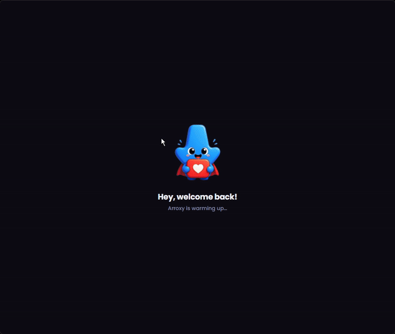
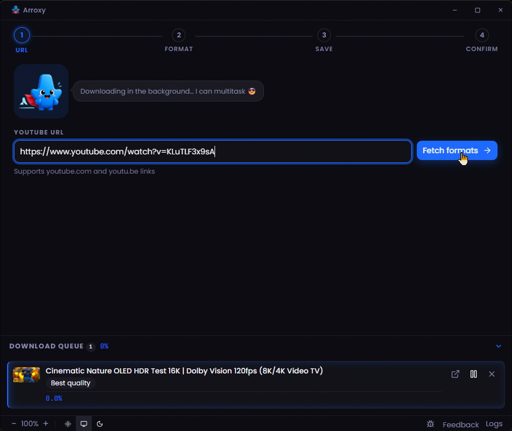
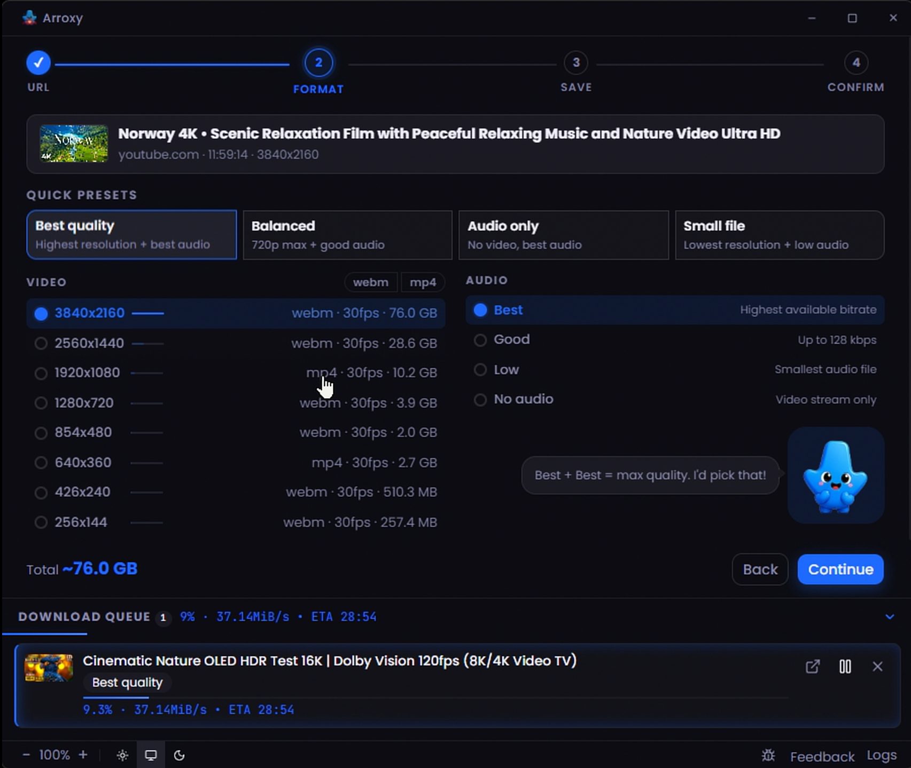
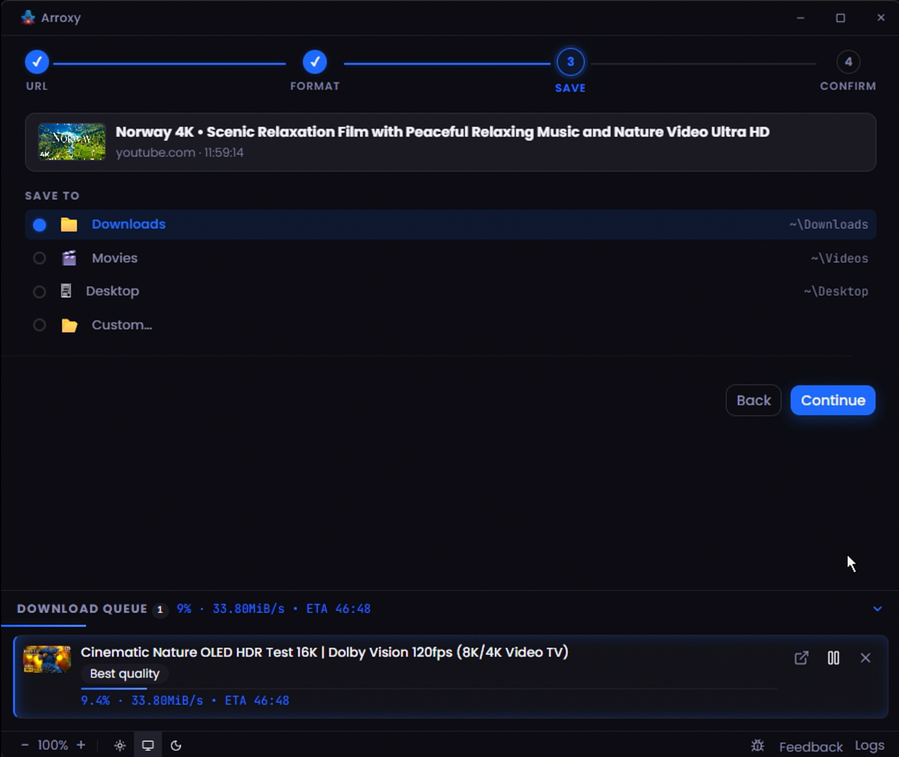
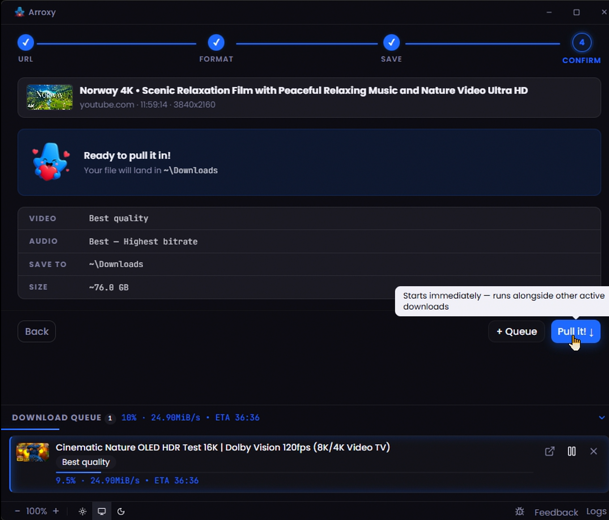
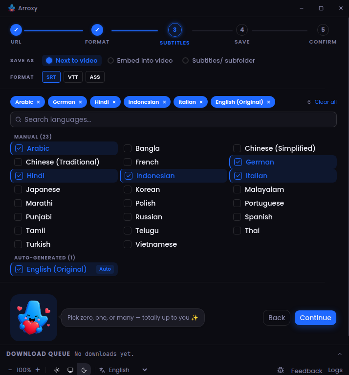

<!-- Generated by readme-src/build.mjs — edit template.md and strings.mjs, not this file -->
<div align="center">
  

# Arroxy — मुफ़्त ओपन-सोर्स YouTube डाउनलोडर

**भाषा:** [English](README.md) · [Español](README.es.md) · [Deutsch](README.de.md) · [Français](README.fr.md) · [日本語](README.ja.md) · [中文](README.zh.md) · [Русский](README.ru.md) · [Українська](README.uk.md) · **हिन्दी**

[](https://github.com/antonio-orionus/Arroxy/releases/latest) [](https://github.com/antonio-orionus/Arroxy/actions/workflows/release.yml)     [](https://github.com/antonio-orionus/scoop-bucket) [](https://github.com/antonio-orionus/homebrew-arroxy) [](https://github.com/antonio-orionus/Arroxy/releases/latest)

**4K &nbsp;•&nbsp; 1080p60 &nbsp;•&nbsp; HDR &nbsp;•&nbsp; Shorts &nbsp;·&nbsp; Windows &nbsp;•&nbsp; macOS &nbsp;•&nbsp; Linux**

**YouTube के विज्ञापनों से वीडियो ख़राब होते-होते थक गए?**
कोई भी वीडियो या Short पूरी क्वालिटी में डाउनलोड करें — 4K, 1080p60, HDR और उससे आगे। तेज़, मुफ़्त और 100% आपका।

कोई विज्ञापन नहीं। कोई ट्रैकिंग नहीं। कोई कुकीज़ नहीं। कोई लॉगिन नहीं। कोई बकवास नहीं।

[**नवीनतम रिलीज़ →**](../../releases/latest) &nbsp;·&nbsp; [Windows](#download) · [macOS](#download) · [Linux](#download)



</div>

> 🌐 यह AI-सहायता प्राप्त अनुवाद है। [अंग्रेज़ी README](README.md) सत्य का स्रोत है। कोई गलती दिखी? [PR का स्वागत है](../../pulls)।

---

## विषय-सूची

- [Arroxy क्यों?](#why)
- [क्या करता है](#what)
- [आने वाले फ़ीचर](#features)
- [डाउनलोड](#download)
  - [Windows: इंस्टॉलर बनाम पोर्टेबल](#win)
  - [macOS पर पहली बार लॉन्च](#macos)
  - [Linux पर पहली बार लॉन्च](#linux)
- [प्राइवेसी](#privacy)
- [अक्सर पूछे जाने वाले प्रश्न](#faq)
- [तकनीकी विवरण](#tech)

---

## <a id="why"></a>Arroxy क्यों?

|                  | Arroxy | ब्राउज़र एक्सटेंशन | ऑनलाइन कन्वर्टर | अन्य डाउनलोडर |
| ---------------- | ------ | ------------ | ------------ | ------------ |
| हमेशा के लिए मुफ़्त       | ✅     | ⚠️           | ⚠️           | ✅           |
| कोई विज्ञापन नहीं       | ✅     | ⚠️           | ❌           | ✅           |
| अकाउंट ज़रूरी नहीं       | ✅     | ✅           | ⚠️           | ⚠️           |
| ऑफ़लाइन काम करता है _(काफ़ी हद तक)_       | ✅     | ❌           | ❌           | ✅           |
| आपकी फ़ाइलें लोकल ही रहती हैं       | ✅     | ✅           | ❌           | ✅           |
| इस्तेमाल की कोई सीमा नहीं       | ✅     | ⚠️           | 🚫           | ✅           |
| ओपन सोर्स       | ✅     | ⚠️           | ❌           | ⚠️           |
| कभी लॉगिन या कुकीज़ नहीं चाहिए       | ✅     | ✅           | ⚠️           | ⚠️           |
| Google अकाउंट बैन का कोई जोखिम नहीं       | ✅     | ✅           | ⚠️           | ⚠️           |

> _"ऑफ़लाइन काम करता है" का मतलब है कि कोई भी कन्वर्ज़न किसी और के सर्वर पर नहीं होता — पूरी पाइपलाइन आपकी ही मशीन पर चलती है। YouTube तक पहुँचने के लिए इंटरनेट तो चाहिए ही। हाँ, हमें पता है।_

> **यह क्यों मायने रखता है:** अधिकांश डेस्कटॉप YouTube डाउनलोडर अंततः आपसे ब्राउज़र की कुकीज़ एक्सपोर्ट करने को कहते हैं, जब भी YouTube अपना बॉट डिटेक्शन अपडेट करता है। ये सेशन हर ~30 मिनट में एक्सपायर होते हैं — और yt-dlp की अपनी डॉक्स चेतावनी देती है कि कुकी-आधारित ऑटोमेशन आपके Google अकाउंट का बैन ट्रिगर कर सकता है। Arroxy कभी भी कुकीज़, लॉगिन या क्रेडेंशियल नहीं माँगता। यह वही टोकन माँगता है जो YouTube किसी भी असली ब्राउज़र को देता है — अकाउंट पर शून्य जोखिम, कोई एक्सपायरी नहीं।

Arroxy एक **मुफ़्त, ओपन-सोर्स, प्राइवेसी-फ़र्स्ट** डेस्कटॉप ऐप है — उन लोगों के लिए जो बिना झंझट की सादगी चाहते हैं। आपके डाउनलोड कभी किसी थर्ड-पार्टी सर्वर से नहीं गुज़रते। शून्य टेलीमेट्री, शून्य डेटा कलेक्शन। बस एक URL पेस्ट करें और हो गया।

---

## <a id="what"></a>क्या करता है

- **कोई भी YouTube URL पेस्ट करें** — वीडियो, Shorts, कुछ भी — Arroxy सेकंडों में सभी उपलब्ध फ़ॉर्मैट लाता है
- **क्वालिटी चुनें** — 4K UHD (2160p), 1440p, 1080p, 720p तक, 60 fps और उससे ज़्यादा फ़्रेम रेट, ऑडियो-only (MP3/AAC/Opus), या क्विक प्रीसेट (बेस्ट क्वालिटी / बैलेंस्ड / स्मॉल फ़ाइल)
- **पूरा हाई-फ़्रेम-रेट सपोर्ट** — 60 fps, 120 fps और HDR स्ट्रीम वैसे ही रहते हैं जैसे YouTube उन्हें एनकोड करता है
- **कहाँ सेव करना है चुनें** — पिछला फ़ोल्डर याद रहता है, या हर बार नया चुनें
- **एक क्लिक में डाउनलोड** — रियल-टाइम प्रोग्रेस बार, कभी भी कैंसल कर सकते हैं
- **कई वीडियो की क़तार** — डाउनलोड पैनल सब कुछ साथ-साथ ट्रैक करता है
- **सबटाइटल डाउनलोड करें** — SRT, VTT या ASS में मैनुअल या ऑटो-जेनरेटेड सबटाइटल पाएँ, किसी भी उपलब्ध भाषा में। वीडियो के बग़ल में सेव करें, पोर्टेबल `.mkv` में एम्बेड करें, या एक डेडिकेटेड `Subtitles/` सबफ़ोल्डर में व्यवस्थित करें
- **SponsorBlock इंटीग्रेशन** — स्पॉन्सर सेगमेंट, इंट्रो, आउट्रो, सेल्फ-प्रोमो और अन्य को स्किप या मार्क करें। उन्हें नॉन-डिस्ट्रक्टिव तरीके से चैप्टर के रूप में मार्क करें या FFmpeg से पूरी तरह काटें — हर कैटेगरी के लिए आपकी पसंद
- **9 भाषाओं में उपलब्ध** — English, Español, Deutsch, Français, 日本語, 中文, Русский, Українська, हिन्दी — आपके सिस्टम की भाषा अपने आप पहचानता है, कभी भी बदला जा सकता है
- **क्लिपबोर्ड वॉच** — कोई भी YouTube लिंक कॉपी करें और ऐप पर वापस आते ही Arroxy URL फ़ील्ड स्वचालित रूप से भर देता है। एक पुष्टि संवाद नियंत्रण बनाए रखता है; उन्नत सेटिंग से कभी भी अक्षम करें

<div align="center">
  
  
  <br/>
  
  
  <br/>
  
</div>

---

## <a id="features"></a>आने वाले फ़ीचर

रोडमैप पर — अभी रिलीज़ नहीं हुए, लगभग प्राथमिकता के क्रम में।

| फ़ीचर | विवरण |
| ------------- | ------------- |
| **प्लेलिस्ट और चैनल डाउनलोड** | प्लेलिस्ट या चैनल URL पेस्ट करके सभी वीडियो एक साथ क़तार में लगाएँ, तारीख़ या संख्या के फ़िल्टर के साथ |
| **एक साथ कई URL डालना** | कई URL एक साथ पेस्ट करके सब एक झटके में शुरू करें |
| **फ़ॉर्मैट कन्वर्ज़न** | डाउनलोड को MP3, WAV, FLAC या अन्य फ़ॉर्मैट में बदलें — किसी अलग टूल की ज़रूरत नहीं |
| **कस्टम फ़ाइल नाम टेम्पलेट** | टाइटल, अपलोडर, तारीख़, रेज़ोल्यूशन या किसी कॉम्बिनेशन से नाम दें — लाइव प्रीव्यू के साथ |
| **शेड्यूल्ड डाउनलोड** | Arroxy के डाउनलोड शुरू करने का समय तय करें — रात भर बड़ी क़तार के लिए उपयोगी |
| **डाउनलोड स्पीड लिमिट** | बैंडविड्थ कैप करें ताकि काम के दौरान डाउनलोड आपका कनेक्शन न भर दे |
| **क्लिप ट्रिमिंग** | शुरू और अंत का समय बताकर वीडियो का सिर्फ़ एक हिस्सा डाउनलोड करें |

> कोई फ़ीचर सोचा है जो यहाँ नहीं है? [रिक्वेस्ट खोलें](../../issues) — कम्यूनिटी की राय तय करती है कि आगे क्या बनेगा।

---

## <a id="download"></a>डाउनलोड

> Arroxy सक्रिय रूप से बन रहा है। नवीनतम बिल्ड [Releases](../../releases) पेज से लें।

| प्लेटफ़ॉर्म | फ़ॉर्मैट |
| ------------------- | ----------------- |
| Windows             | इंस्टॉलर (NSIS) या पोर्टेबल `.exe` |
| macOS               | `.dmg` (Intel + Apple Silicon) |
| Linux               | `.AppImage` या `.flatpak` (sandboxed) |

बस डाउनलोड, रन, हो गया।

### पैकेज मैनेजर से इंस्टॉल

| चैनल | कमांड |
| ------------------ | ------------------ |
| Winget   | `winget install AntonioOrionus.Arroxy` (या `winget install arroxy`) |
| Scoop    | `scoop bucket add arroxy https://github.com/antonio-orionus/scoop-bucket && scoop install arroxy` |
| Homebrew | `brew tap antonio-orionus/arroxy && brew install --cask arroxy` |

### <a id="win"></a>Windows: इंस्टॉलर बनाम पोर्टेबल

दो बिल्ड उपलब्ध हैं — जो ज़रूरत हो वो चुनें:

|                        | NSIS इंस्टॉलर | पोर्टेबल `.exe` |
| ---------------------- | ------------------------ | ----------------------- |
| इंस्टॉलेशन ज़रूरी          | हाँ  | नहीं — कहीं से भी चलाएँ  |
| ऑटो-अपडेट          | ✅ ऐप में  | ❌ मैन्युअल डाउनलोड  |
| स्टार्टअप स्पीड          | ✅ तेज़  | ⚠️ कोल्ड स्टार्ट धीमा  |
| स्टार्ट मेन्यू में जुड़ता है          | ✅                       | ❌                      |
| आसान अनइंस्टॉल          | ✅                       | ❌ बस फ़ाइल डिलीट कर दें  |

**सिफ़ारिश:** अगर आप चाहते हैं कि Arroxy ख़ुद अपडेट हो और तेज़ शुरू हो, तो NSIS इंस्टॉलर लें। बिना इंस्टॉल और बिना रजिस्ट्री छेड़े चाहिए तो पोर्टेबल `.exe` लें।

### <a id="macos"></a>macOS पर पहली बार लॉन्च

> **नोट:** मेरे पास Mac नहीं है, इसलिए macOS बिल्ड मैंने ख़ुद टेस्ट नहीं किया है। अगर कुछ काम नहीं करता — ऐप नहीं खुलता, `.dmg` टूटा हुआ है, क्वारंटीन वर्कअराउंड फ़ेल होता है — कृपया [issue खोलें](../../issues) और बताएँ। macOS यूज़र्स से कोई भी फ़ीडबैक सच में सराहनीय है।

Arroxy अभी कोड-साइन्ड नहीं है। पहली बार खोलने पर macOS एक सुरक्षा चेतावनी दिखाएगा — यह अपेक्षित है, फ़ाइल ख़राब नहीं है।

**तरीक़ा 1: सिस्टम सेटिंग्स (अनुशंसित)**

| क़दम | क्रिया |
| :--------------------: | ---------------------- |
| 1 | Arroxy आइकॉन पर राइट-क्लिक करें और **Open** चुनें। |
| 2 | चेतावनी डायलॉग आएगा। **Cancel** क्लिक करें (Move to Trash न क्लिक करें)। |
| 3 | **System Settings → Privacy & Security** खोलें। |
| 4 | **Security** सेक्शन तक स्क्रॉल करें — दिखेगा _"Arroxy was blocked from use because it is not from an identified developer."_ |
| 5 | **Open Anyway** क्लिक करें, फिर पासवर्ड या Touch ID से कन्फ़र्म करें। |

क़दम 5 के बाद Arroxy सामान्य रूप से खुलेगा और चेतावनी फिर कभी नहीं आएगी।

**तरीक़ा 2: टर्मिनल (एडवांस्ड)**

अगर ऊपर वाला काम नहीं करता, Arroxy को Applications में खींचने के बाद यह एक बार चलाएँ:

```bash
xattr -dr com.apple.quarantine /Applications/Arroxy.app
```

### <a id="linux"></a>Linux पर पहली बार लॉन्च

AppImage इंस्टॉल नहीं होते — ये सीधे चलते हैं। बस पहले फ़ाइल को एक्ज़ीक्यूटेबल मार्क करना होता है।

**तरीक़ा 1: फ़ाइल मैनेजर**

`.AppImage` फ़ाइल पर राइट-क्लिक → **Properties** → **Permissions** → **Allow executing file as program** ऑन करें, फिर डबल-क्लिक से चलाएँ।

**तरीक़ा 2: टर्मिनल**

```bash
chmod +x Arroxy-*.AppImage
./Arroxy-*.AppImage
```

अगर फिर भी नहीं चलता, तो शायद FUSE नहीं है (AppImage के लिए ज़रूरी):

```bash
# Ubuntu / Debian
sudo apt install -y libfuse2

# Fedora
sudo dnf install -y fuse-libs

# Arch
sudo pacman -S fuse2
```

**Flatpak (सैंडबॉक्स विकल्प)**

सही मायनों में सैंडबॉक्स्ड इंस्टॉल चाहिए? उसी रिलीज़ पेज से `Arroxy-*.flatpak` बंडल लें और लोकल इंस्टॉल करें — Flathub सेटअप नहीं, एडमिन अधिकार नहीं, `libfuse2` शिम भी नहीं चाहिए (Flatpak सैंडबॉक्स के लिए bubblewrap इस्तेमाल करता है)।

```bash
flatpak install --user Arroxy-*.flatpak
flatpak run io.github.antonio_orionus.Arroxy
```

---

## <a id="privacy"></a>प्राइवेसी

Arroxy पूरी तरह आपकी मशीन पर चलता है। जब आप वीडियो डाउनलोड करते हैं:

1. Arroxy [yt-dlp](https://github.com/yt-dlp/yt-dlp) के ज़रिए सीधे YouTube URL को कॉल करता है — एक ऑडिटेबल, हमेशा अप-टू-डेट ओपन-सोर्स टूल
2. फ़ाइल सीधे आपके चुने हुए फ़ोल्डर में सेव होती है
3. शून्य टेलीमेट्री। कुछ भी लॉग, ट्रैक या कहीं नहीं भेजा जाता — कभी नहीं।

आपकी देखने की हिस्ट्री, डाउनलोड हिस्ट्री और फ़ाइल कंटेंट आपके डिवाइस पर रहते हैं। 100% प्राइवेट।

---

## <a id="faq"></a>अक्सर पूछे जाने वाले प्रश्न

**मैं किन क्वालिटी में डाउनलोड कर सकता हूँ?**
जो भी YouTube देता है — 4K UHD (2160p), 1440p QHD, 1080p Full HD, 720p, 480p, 360p और ऑडियो-only। हाई फ़्रेम-रेट (60 fps, 120 fps) और HDR कंटेंट जैसे हैं वैसे ही रहते हैं। Arroxy हर उपलब्ध फ़ॉर्मैट दिखाता है और आपको ठीक वही चुनने देता है जो लेना है।

**क्या यह सच में मुफ़्त है?**
हाँ। MIT लाइसेंस। कोई प्रीमियम टियर नहीं, कोई फ़ीचर लॉक नहीं।

**Arroxy किन भाषाओं में उपलब्ध है?**
नौ, बॉक्स से बाहर: English, Español (स्पेनिश), Deutsch (जर्मन), Français (फ़्रेंच), 日本語 (जापानी), 中文 (चीनी), Русский (रूसी), Українська (यूक्रेनी) और हिन्दी। Arroxy पहले लॉन्च पर आपके ऑपरेटिंग सिस्टम की भाषा अपने आप पहचानता है, और आप टूलबार में भाषा चुनने वाले से कभी भी बदल सकते हैं। अनुवाद जोड़ना या सुधारना है? लोकेल फ़ाइलें `src/shared/i18n/locales/` में सादे TypeScript ऑब्जेक्ट्स हैं — [PR खोलें](../../pulls)।

**क्या मुझे कुछ इंस्टॉल करना होगा?**
नहीं। yt-dlp और ffmpeg पहले लॉन्च पर अपने ऑफ़िशियल GitHub releases से अपने आप डाउनलोड हो जाते हैं और आपकी मशीन पर कैश हो जाते हैं। उसके बाद कोई एक्स्ट्रा सेटअप ज़रूरी नहीं।

**अगर YouTube कुछ बदले तो क्या यह काम करता रहेगा?**
हाँ — और Arroxy में दो लेयर रिज़िलियेंस है। पहला, yt-dlp सबसे एक्टिवली मेनटेन्ड ओपन-सोर्स टूल्स में से एक है — YouTube के बदलाव के घंटों के भीतर अपडेट होता है। दूसरा, Arroxy कुकीज़ या आपके Google अकाउंट पर बिल्कुल निर्भर नहीं है, इसलिए कोई सेशन एक्सपायर नहीं होता और कोई क्रेडेंशियल रोटेट नहीं करना। यह कॉम्बिनेशन इसे ब्राउज़र की कुकीज़ एक्सपोर्ट करने पर निर्भर टूल्स से कहीं ज़्यादा स्थिर बनाता है।

**क्या मैं प्लेलिस्ट डाउनलोड कर सकता हूँ?**
अभी सिंगल वीडियो सपोर्टेड हैं। प्लेलिस्ट और चैनल सपोर्ट रोडमैप पर है — देखें [आने वाले फ़ीचर](#features)।

**क्या इसे मेरे YouTube अकाउंट या कुकीज़ की ज़रूरत है?**
नहीं — और यह जितना लगता है उससे ज़्यादा अहम है। ज़्यादातर टूल्स जो YouTube के अपडेट के बाद बंद हो जाते हैं, आपको ब्राउज़र की YouTube कुकीज़ एक्सपोर्ट करने को कहते हैं। यह वर्कअराउंड हर ~30 मिनट में टूटता है क्योंकि YouTube सेशन रोटेट करता है, और yt-dlp की अपनी डॉक्स चेताती है कि इससे आपका Google अकाउंट फ़्लैग हो सकता है। Arroxy कभी कुकीज़ या क्रेडेंशियल इस्तेमाल नहीं करता। कोई लॉगिन नहीं। कोई अकाउंट लिंक नहीं। कुछ एक्सपायर नहीं होता, कुछ बैन नहीं होता।

**macOS कहता है "ऐप ख़राब है" या "नहीं खुल सकती" — क्या करूँ?**
यह macOS Gatekeeper बिना साइन की हुई ऐप को ब्लॉक कर रहा है — असली नुक़सान नहीं है। क़दम-दर-क़दम के लिए देखें [macOS पर पहली बार लॉन्च](#macos)।

**क्या यह क़ानूनी है?**
ज़्यादातर अधिकार-क्षेत्रों में पर्सनल इस्तेमाल के लिए वीडियो डाउनलोड करना आम तौर पर स्वीकार्य है। YouTube की Terms of Service और अपने स्थानीय क़ानूनों का पालन करना आपकी ज़िम्मेदारी है।

---

## <a id="tech"></a>तकनीकी विवरण

तकनीकी विवरण, सोर्स से बिल्ड करने के निर्देश, प्लेटफ़ॉर्म-वार ज़रूरतें और योगदान कैसे करें, इसके लिए [अंग्रेज़ी README](README.md#tech) देखें।

---

---

> **उपयोग की शर्तें:** Arroxy केवल पर्सनल, प्राइवेट इस्तेमाल के लिए एक टूल है। यह सुनिश्चित करना कि आपके डाउनलोड YouTube की [Terms of Service](https://www.youtube.com/t/terms) और आपके अधिकार-क्षेत्र के कॉपीराइट क़ानूनों का पालन करते हैं — यह पूरी तरह आपकी ज़िम्मेदारी है। ऐसी सामग्री डाउनलोड, पुनरुत्पादित या वितरित करने के लिए Arroxy का उपयोग न करें जिसका उपयोग करने का अधिकार आपके पास नहीं है। Arroxy के डेवलपर किसी भी दुरुपयोग के लिए ज़िम्मेदार नहीं हैं।

<div align="center">
  <sub>MIT लाइसेंस · <a href="https://x.com/OrionusAI">@OrionusAI</a> द्वारा प्यार से बनाया गया</sub>
</div>
