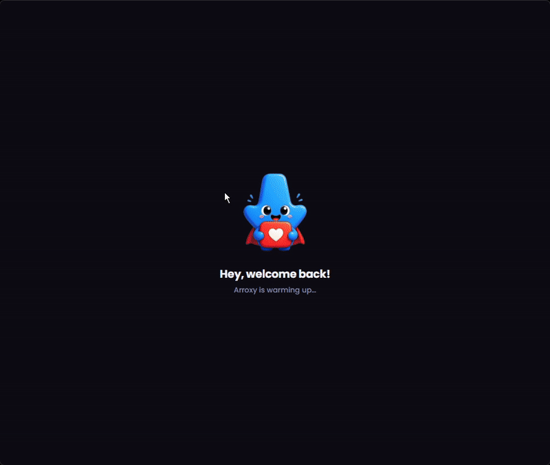
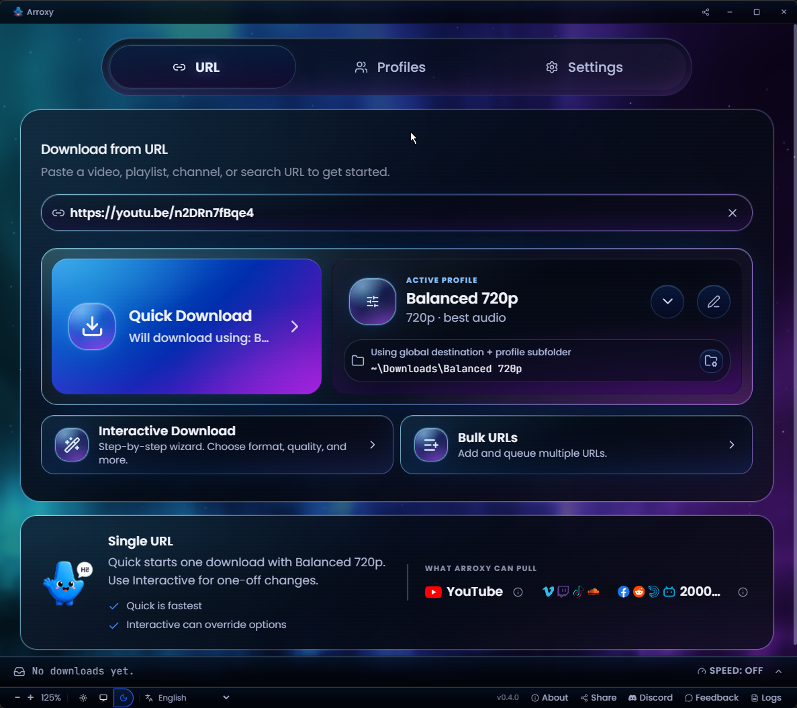
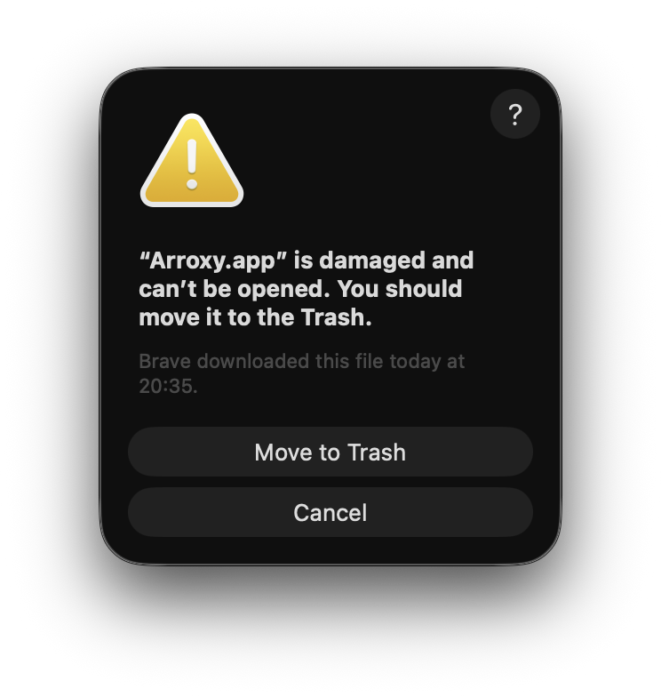
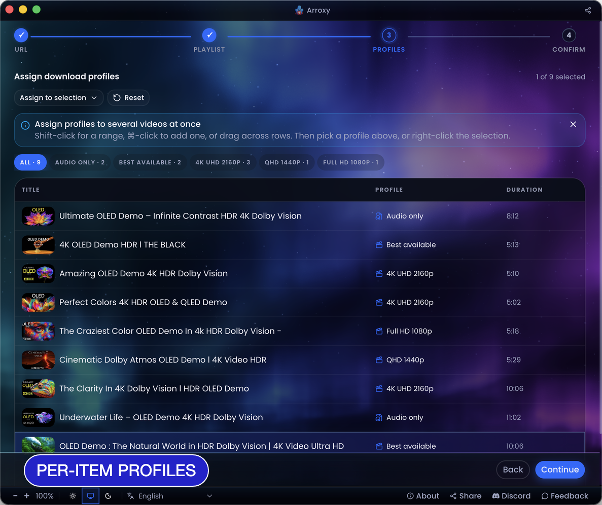
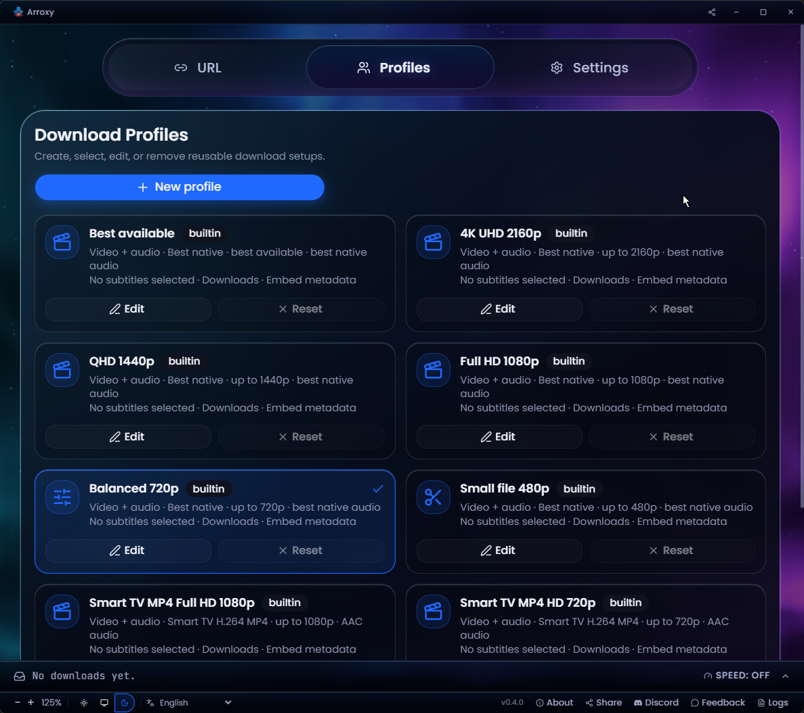
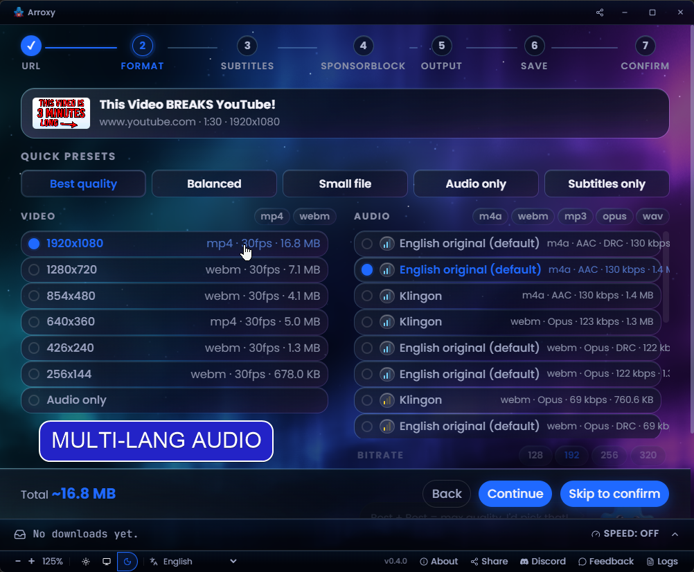
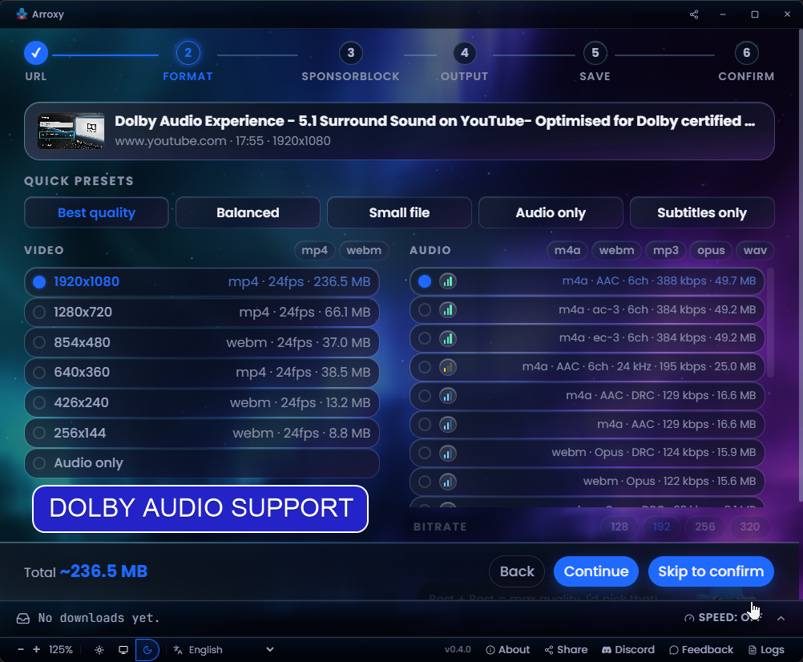
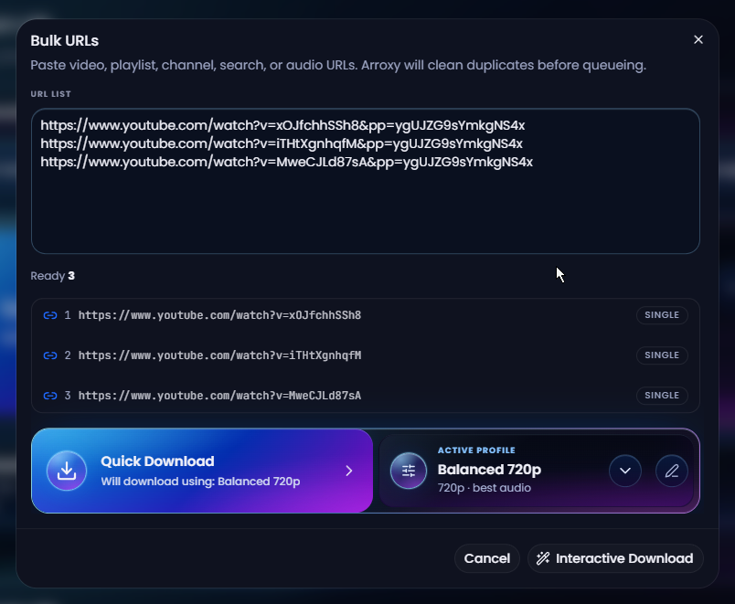
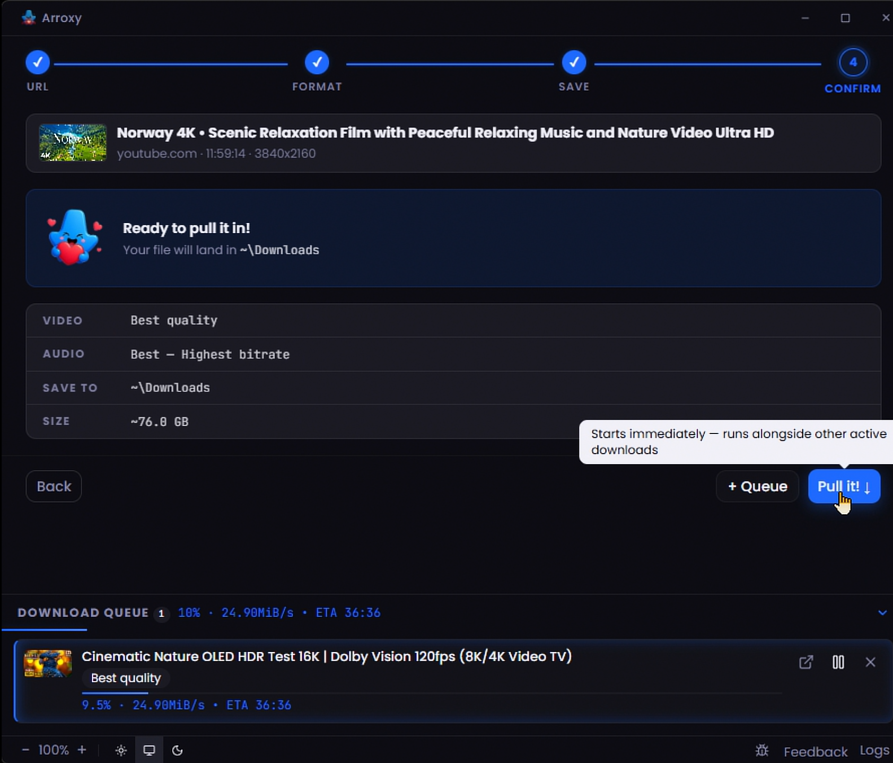

<div align="center">
  

# Arroxy — Windows, macOS နှင့် Linux အတွက် အခမဲ့ Open-Source YouTube (+ ၂၀၀၀ ဆိုဒ်) Downloader

**4K · 1080p60 · HDR · Surround/Dolby audio · Playlists · MP3 · Shorts · Music · Channels · Subtitles · SponsorBlock · +2000 sites**

**ဘာသာဖြင့် ဖတ်ရှုရန်:** [Afaan Oromoo](README.om.md) · [Bahasa Indonesia](README.id.md) · [Deutsch](README.de.md) · [English](README.md) · [Español](README.es.md) · [Français](README.fr.md) · [Kiswahili](README.sw.md) · [O'zbekcha](README.uz.md) · [Português](README.pt.md) · [Tiếng Việt](README.vi.md) · [Türkçe](README.tr.md) · [አማርኛ](README.am.md) · [العربية](README.ar.md) · [اردو](README.ur.md) · [پښتو](README.ps.md) · [বাংলা](README.bn.md) · [हिन्दी](README.hi.md) · **မြန်မာဘာသာ** · [Ελληνικά](README.el.md) · [Русский](README.ru.md) · [Српски](README.sr.md) · [Українська](README.uk.md) · [中文](README.zh.md) · [日本語](README.ja.md)

[](https://github.com/antonio-orionus/Arroxy/releases/latest) [](https://github.com/antonio-orionus/Arroxy/actions/workflows/release.yml) [](https://arroxy.orionus.dev/)   

**YouTube နှင့် ၂၀၀၀+ ထောက်ပံ့သောဆိုဒ်များ** မှ ဗီဒီယိုများ၊ Shorts၊ သီချင်းများ၊ channel များ၊ podcast များ သို့မဟုတ် audio track များကို ဒေါင်းလုဒ်ဆွဲပါ — 60 fps တွင် 4K HDR အထိ၊ သို့မဟုတ် MP3 / AAC / Opus အဖြစ်။ Windows, macOS နှင့် Linux တွင် သင့်ကွန်ပျူတာပေါ်တွင်သာ run ပါသည်။ **ကြော်ငြာမပါ၊ bloat မပါ၊ upsell မပါ။**

[**↓ နောက်ဆုံး Release ကို ဒေါင်းလုဒ်ဆွဲပါ**](#install) &nbsp;·&nbsp; [**ဝဘ်ဆိုက်**](https://arroxy.orionus.dev/) &nbsp;·&nbsp; [Windows ပထမဆုံး launch](#windows-first-launch) · [macOS ပထမဆုံး launch](#macos-first-launch) · [Linux ပထမဆုံး launch](#linux-first-launch)

[](https://discord.gg/ueGvXwQH8y)





Arroxy သည် သင့်အချိန်ကို သက်သာစေပါက ⭐ တစ်ချက်က အခြားသူများ ရှာတွေ့ရန် ကူညီပါသည်။

</div>

> **What is Arroxy?** Arroxy is a free, open-source desktop GUI that downloads videos, audio, playlists, and subtitles from YouTube and 2000+ other [yt-dlp](https://github.com/yt-dlp/yt-dlp)-supported sites. It runs on Windows 10/11, macOS 11+ (Intel + Apple Silicon), and Linux (AppImage, Flatpak, tar.gz). MIT licensed. No account, no ads, no usage limits. Distributed via [Winget](https://winget.run/pkg/AntonioOrionus/Arroxy), [Scoop](https://github.com/antonio-orionus/scoop-bucket), [Homebrew Cask](https://github.com/antonio-orionus/homebrew-arroxy), Flatpak, AppImage, and direct download.
>
> _Last updated: 2026-09-02._

---

## မာတိကာ

- [ထည့်သွင်းခြင်းနှင့် ပထမဆုံးဖွင့်ခြင်း](#install)
  - [Package manager မှတစ်ဆင့် ထည့်သွင်းပါ](#package-manager)
  - [Windows ပထမဆုံး launch](#windows-first-launch)
  - [macOS ပထမဆုံး launch](#macos-first-launch)
  - [သတိပေးချက် ဘာကြောင့်မြင်ရနိုင်သနည်း](#why-warning)
  - [Linux ပထမဆုံး launch](#linux-first-launch)
  - [သင့်ဒေါင်းလုဒ်ကို အတည်ပြုပါ (SHA256)](#verify)
- [Arroxy ဘာကြောင့်](#why)
- [လုပ်ဆောင်ချက်များ](#features)
- [ကိုယ်ရေးကိုယ်တာ](#privacy)
- [မေးလေ့ရှိသောမေးခွန်းများ](#faq)
- [လမ်းပြမြေပုံ](#roadmap)
- [Arroxy ကို ပံ့ပိုးရန်](#support)
- [တည်ဆောက်ထားသောနည်းပညာ](#tech)

---

## <a id="install"></a>ထည့်သွင်းခြင်းနှင့် ပထမဆုံးဖွင့်ခြင်း

| Platform | Format                                                                                                                                                                                                                                                                                                                                                                                                                                                                                                                                                                                                                                       |
| ------------------- | ------------------------------------------------------------------------------------------------------------------------------------------------------------------------------------------------------------------------------------------------------------------------------------------------------------------------------------------------------------------------------------------------------------------------------------------------------------------------------------------------------------------------------------------------------------------------------------------------------------------------------------------------------- |
| Windows             | [](https://github.com/antonio-orionus/Arroxy/releases/latest/download/Arroxy-win-x64-Setup.exe) [](https://github.com/antonio-orionus/Arroxy/releases/latest/download/Arroxy-win-x64-Portable.exe)                                                                                                                                                                                                        |
| macOS               | [](https://github.com/antonio-orionus/Arroxy/releases/latest/download/Arroxy-mac-arm64.dmg) [](https://github.com/antonio-orionus/Arroxy/releases/latest/download/Arroxy-mac-x64.dmg)                                                                                                                                                                                                                     |
| Linux               | [](https://github.com/antonio-orionus/Arroxy/releases/latest/download/Arroxy-linux-x64.AppImage) [](https://github.com/antonio-orionus/Arroxy/releases/latest/download/Arroxy-linux-x64.flatpak) [](https://github.com/antonio-orionus/Arroxy/releases/latest/download/Arroxy-linux-x64.tar.gz) |
| Verify              | [](https://github.com/antonio-orionus/Arroxy/releases/latest/download/SHA256SUMS)                                                                                                                                                                                                                                                                                                                                                                                                                                              |

[**နောက်ဆုံး release ကို ယူပါ →**](https://github.com/antonio-orionus/Arroxy/releases/latest)

### <a id="package-manager"></a>Package manager မှတစ်ဆင့် ထည့်သွင်းပါ

Package manager တစ်ခုကို သုံးနေပြီလား? ကိုယ်တိုင် download ဆင်းသောနည်းလမ်းကို ကျော်လွှားနိုင်သည်။

| Channel | Command                                                                                |
| ------------------ | ------------------------------------------------------------------------------------------------- |
| Winget             | `winget install AntonioOrionus.Arroxy`                                                            |
| Scoop              | `scoop bucket add arroxy https://github.com/antonio-orionus/scoop-bucket && scoop install arroxy` |
| Homebrew           | `brew tap antonio-orionus/arroxy && brew install --cask arroxy`                                   |
| Flatpak (local file) | `flatpak install --user ./Arroxy-linux-x64.flatpak`                                            |

### <a id="windows-first-launch"></a>Windows ပထမဆုံး launch

ပထမဆုံး ဖွင့်သောအခါ **"Windows protected your PC"** သို့မဟုတ် **"Unknown publisher."** ဟု မြင်ရနိုင်သည်။ ၎င်းသည် `Arroxy-win-x64-Setup.exe` နှင့် `Arroxy-win-x64-Portable.exe` နှစ်မျိုးစလုံးအတွက် သက်ဆိုင်သည်။ Arroxy သည် အခမဲ့ open-source ဖြစ်ပြီး Windows builds များကို ငွေပေးချေ certificate ဖြင့် code-sign မလုပ်ထားသောကြောင့် SmartScreen က flag လုပ်သည်။ ၎င်းသည် Arroxy မဘေးကင်းကြောင်း **အလိုအလျောက်** မဆိုလိုပါ။ ဆက်လုပ်ရန်:

<div align="center">
  
  
</div>

1. **More info** ကို နှိပ်ပါ။
2. **Run anyway** ကို နှိပ်ပါ။

#### Windows Defender သည် ဖိုင်ကို flag လုပ်ခြင်း သို့မဟုတ် ဖယ်ရှားပါက

Defender heuristics သည် တစ်ခါတစ်ရံ unsigned NSIS installers နှင့် Electron portables ကို သံသယဖြစ်ဖွယ်ဟု flag လုပ်တတ်သည်။ Defender က `Arroxy-win-x64-Setup.exe` သို့မဟုတ် `Arroxy-win-x64-Portable.exe` ကို quarantine ထည့်ပါက **Windows Security → Virus & threat protection → Protection history** မှ ပြန်ယူပြီး Arroxy executable ကို **Manage settings → Add or remove exclusions** အောက်တွင် ခွင့်ပြုထားသောအရာအဖြစ် ထည့်သွင်းပါ။ SmartScreen ကဲ့သို့ပင် trigger သည် ပျောက်ဆုံးသော publisher signature ဖြစ်ပြီး malware တွေ့ရှိမှုမဟုတ်ပါ။

> Arroxy ကို တရားဝင် GitHub Releases စာမျက်နှာမှသာ ဒေါင်းလုဒ်ဆွဲပါ။ ဖိုင်ကို အခြား website မှ ရရှိပါက သို့မဟုတ် တစ်ယောက်ယောက်က ပေးပို့ပါက ၎င်းကို ဖျက်ပြီး တရားဝင် source မှ အသစ် download ဆင်းပါ။ source code ကို public တင်ထားသောကြောင့် သင်ကြိုက်ပါက ကိုယ်တိုင် စစ်ဆေးနိုင်သည် သို့မဟုတ် Arroxy ကိုယ်တိုင် build လုပ်နိုင်သည်။

### <a id="macos-first-launch"></a>macOS ပထမဆုံး launch

Arroxy သည် macOS အတွက် code-sign မလုပ်ရသေးသောကြောင့် DMG မှ install လုပ်ပြီးနောက် Gatekeeper သည် ကြောက်စရာ *"Arroxy.app is damaged and can't be opened"* dialog ကို ပြသနိုင်သည်။ ထို message သည် macOS က unsigned app ကို quarantine လုပ်ထားသည်ဟု ဆိုလိုပြီး app files တကယ်ပျက်စီးနေသည်ဟု မဆိုလိုပါ။ လက်ရှိ macOS တွင် ယုံကြည်ရသော ဖြေရှင်းနည်းမှာ Terminal ဖြစ်သည်:

<div align="center">
  
</div>

1. တပ်ဆင်ထားသော DMG မှ `Arroxy.app` ကို `/Applications` သို့ ဆွဲထည့်ပါ။
2. Terminal ကိုဖွင့်ပြီး ဤ command နှစ်ခုကို run ပါ:

```bash
sudo xattr -dr com.apple.quarantine /Applications/Arroxy.app
open /Applications/Arroxy.app
```

ပထမ command သည် သင်ထည့်သွင်းထားသော Arroxy copy မှ quarantine attribute ကို ဖယ်ရှားသည်။ ဒုတိယ command သည် app ကို ဖွင့်သည်။ `sudo` သည် သင့် Mac password ကို တောင်းနိုင်သည်။ Terminal သည် password ရိုက်နေချိန်တွင် စာလုံးများကို မပြပါ။

**Apple Silicon နှင့် Intel:** M-series Mac (M1 / M2 / M3 / M4) ပေါ်တွင် `arm64` DMG ကိုဒေါင်းလုဒ်ဆွဲပါ။ Intel Mac ပေါ်တွင် `x64` DMG ကိုဒေါင်းလုဒ်ဆွဲပါ။ မမှန်ကန်သော build ကိုဖွင့်ပါက Rosetta မှတစ်ဆင့် အလုပ်လုပ်သော်လည်း သိသာစွာ နှေးကွေးပါမည်။

> macOS builds များကို Apple Silicon နှင့် Intel runners တို့ပေါ်တွင် CI မှတဆင့် ထုတ်လုပ်သည်။ ပြဿနာများကြုံတွေ့ပါက [issue တင်ပါ](../../issues) — macOS သုံးစွဲသူများ၏ feedback သည် macOS testing cycle ကို တက်ကြွစွာ ပုံဖော်ပေသည်။

### <a id="why-warning"></a>သတိပေးချက် ဘာကြောင့်မြင်ရနိုင်သနည်း

Arroxy သည် open-source ဖြစ်ပြီး MIT-licensed ဖြစ်သည်။ Windows နှင့် macOS builds များသည် **code-sign မလုပ်ထားပါ** — Apple Developer ID နှင့် Windows EV code-signing certificates တို့သည် တစ်နှစ်လျှင် ဒေါ်လာ ရာနှင့်ချီ ကုန်ကျပြီး indie project တစ်ခုအတွက် ကိုယ်တိုင်ကျခံရသည်။ ထိုလက်မှတ်များမပါဘဲ Windows SmartScreen နှင့် macOS Gatekeeper တို့သည် ပထမဆုံး launch တွင် သတိပေးလိမ့်မည်။ သတိပေးချက်များ၏ အဓိပ္ပာယ်မှာ *သင့် OS က publisher ကို မသိသောကြောင့်ဖြစ်ပြီး* Arroxy malware ဖြစ်ကြောင်း မဆိုလိုပါ။

Arroxy ကိုယ်တိုင် စစ်ဆေးရန် နည်းလမ်းသုံးမျိုး၊ တဆင့်ပြင်းထန်လာသောစီစဉ်မှုဖြင့်:

- **Source ကိုဖတ်ပါ။** မျဉ်းတိုင်းသည် [GitHub](https://github.com/antonio-orionus/Arroxy) တွင်ရှိပြီး [source မှ build](#tech) လုပ်နိုင်သည်။
- **SHA256 စစ်ဆေးပါ။** သင့်ဖိုင်ကို ထုတ်ဝေထားသော [`SHA256SUMS`](../../releases/latest) နှင့် ကိုက်ညီမှုစစ်ဆေးပါ — အောက်တွင် [သင့်ဒေါင်းလုဒ်ကို အတည်ပြုပါ](#verify) ကိုကြည့်ပါ။
- **Third-party scan ပြုလုပ်ပါ။** ဖိုင်ကို [VirusTotal](https://www.virustotal.com) တွင် upload ပြုလုပ်ပါ။

### <a id="linux-first-launch"></a>Linux ပထမဆုံး launch

AppImages များကို တိုက်ရိုက် run နိုင်သည် — ထည့်သွင်းမှုမလိုအပ်ပါ။ ဖိုင်ကို executable အဖြစ် mark လုပ်ရုံသာ လိုအပ်သည်။

**File manager:** `.AppImage` ကို right-click → **Properties** → **Permissions** → **Allow executing file as program** ကိုဖွင့်ပြီး double-click နှိပ်ပါ။

**Terminal:**

```bash
chmod +x Arroxy-linux-x64.AppImage
./Arroxy-linux-x64.AppImage
```

စတင်၍ မရသေးလျှင် mount မလုပ်ဘဲ ဖွင့်ပါ — အပို system package မလိုပါ:

```bash
./Arroxy-linux-x64.AppImage --appimage-extract-and-run
```

**ရွေးချယ်နိုင်သော desktop ပေါင်းစည်းမှု:** [AppImageLauncher](https://github.com/TheAssassin/AppImageLauncher) ကို တစ်ကြိမ်ထည့်သွင်းပါ၊ သင် double-click နှိပ်သော AppImage တိုင်းသည် သင့် launcher menu တွင် အလိုအလျောက် မှတ်ပုံတင်ပြီး ကိုယ်တိုင် `.desktop` ဖိုင်ဖန်တီးရန် မလိုအပ်တော့ပါ။

**ရိုးရိုး tarball (FUSE မလို၊ install မလို):**

`.tar.gz` ဗားရှင်းသည် AppImage အခွံမပါသော အက်ပ်တူပင်ဖြစ်သည် — ကြိုက်ရာနေရာတွင် ဖြေပြီး ဖွင့်လိုက်ပါ။ install စရာမလို၊ system package လည်း မလိုပါ။

```bash
tar xzf Arroxy-linux-x64.tar.gz
./Arroxy-linux-x64/arroxy
```

**Flatpak (sandboxed alternative):** တူညီသော release page မှ `Arroxy-*.flatpak` ကို download ဆင်းပါ။

Ubuntu တွင် Flatpak အစား Snap ပါလာသဖြင့် Flatpak ကို ဦးစွာ install ပြီး Flathub ကို ထည့်ပါ — bundle သည် runtime ကို ထိုမှ ရယူသည်:

```bash
sudo apt install -y flatpak
flatpak remote-add --user --if-not-exists flathub https://dl.flathub.org/repo/flathub.flatpakrepo
flatpak install --user ./Arroxy-linux-x64.flatpak
flatpak run io.github.antonio_orionus.Arroxy
```

**ထုတ်ဝေမှုစာမျက်နှာရှိ Linux ဒေါင်းလုဒ်များသည် x86_64 သီးသန့်ဖြစ်သည်။** ARM64 စက်များ (Raspberry Pi, Asahi Linux) တွင် Flatpak install လုပ်၍ရသော်လည်း ဖွင့်သည့်အခါ `bwrap: execvp ldconfig: Exec format error` ဖြင့် ကျရှုံးသည်။

<details>
<summary><strong><a id="verify"></a>သင့်ဒေါင်းလုဒ်ကို အတည်ပြုပါ (SHA256)</strong></summary>

Release တိုင်းသည် binaries များနှင့်အတူ `SHA256SUMS` ဖိုင်ကို ထုတ်ဝေသည်။ သင့်ဒေါင်းလုဒ်သည် ပိုဆောင်ရင်းတွင် ပျက်စီးသွားခြင်း သို့မဟုတ် ကြားဖြတ်ဝင်ရောက်ပြောင်းလဲမှုမရှိကြောင်း စစ်ဆေးရန် ဖိုင်ကို locally hash ပြုလုပ်ပြီး `SHA256SUMS` ရှိ လိုင်းနှင့် ကိုက်ညီမှုစစ်ဆေးပါ။ နောက်ဆုံး release page ဖွင့်ပါ → **Assets** → `SHA256SUMS` ကိုဒေါင်းလုဒ်ဆွဲပါ။

**Windows (PowerShell သို့မဟုတ် Command Prompt):**

```powershell
certutil -hashfile Arroxy-win-x64-Setup.exe SHA256
```

**macOS (Terminal):**

```bash
shasum -a 256 Arroxy-mac-arm64.dmg
```

**Linux (Terminal):**

```bash
sha256sum Arroxy-linux-x64.AppImage
```

Third-party malware scan လိုချင်ပါသလား? [VirusTotal](https://www.virustotal.com) တွင် ဖိုင်ကို upload ပြုလုပ်ပါ။ unsigned Electron apps အတွက် သေးငယ်သော engines မှ generic-heuristic flags အနည်းငယ်ရှိခြင်းသည် ပုံမှန်ဖြစ်သည်၊ သို့သော် အဓိက engines များမှ ကျယ်ပြန့်သော detections ရှိပါက စစ်မှန်သောစိုးရိမ်ဖွယ်ရာဖြစ်သည်။

</details>

<details>
<summary><strong>Windows: Installer နှင့် Portable နှိုင်းယှဉ်</strong></summary>

|               | NSIS Installer | Portable `.exe` |
| ------------- | :----------------------: | :---------------------: |
| ထည့်သွင်းမှုလိုအပ်သည် | ဟုတ်သည်  | မလိုအပ်ပါ — မည်သည့်နေရာမှမဆို run ပါ  |
| Auto-update | ✅ app အတွင်းမှ  | ❌ ကိုယ်တိုင် download ဆင်းရသည်  |
| Startup မြန်နှုန်း | ✅ ပိုမြန်သည်  | ⚠️ cold start နှေးသည်  |
| Start Menu တွင် ထည့်သည် |            ✅            |           ❌            |
| လွယ်ကူစွာ ဖြုတ်နိုင်သည် |            ✅            | ❌ ဖိုင်ကိုဖျက်ပစ်ပါ  |

**အကြံပြုချက်:** auto-update နှင့် ပိုမြန်သော startup အတွက် NSIS installer ကို အသုံးပြုပါ။ install မလုပ်ဘဲ registry မသုံးသောနည်းအတွက် portable `.exe` ကို အသုံးပြုပါ။

</details>

---

## <a id="why"></a>Arroxy ဘာကြောင့်

အသုံးများဆုံး alternatives များနှင့် side-by-side နှိုင်းယှဉ်ချက်:

|            | Arroxy | 4K Video Downloader | JDownloader | Y2Mate / online converters | Browser extensions |
| ---------- | :----: | :-----------------: | :---------: | :------------------------: | :----------------: |
| အခမဲ့၊ premium tier မပါ |   ✅   |         ⚠️          |     ✅      |             ⚠️             |         ⚠️         |
| Open source |   ✅   |         ❌          |     ❌      |             ❌             |         ⚠️         |
| Local processing သာ |   ✅   |         ✅          |     ✅      |             ❌             |         ✅         |
| Login သို့မဟုတ် cookie export မလိုအပ် |   ✅   |         ⚠️          |     ⚠️      |             ⚠️             |         ✅         |
| အသုံးပြုမှုကန့်သတ်ချက်မပါ |   ✅   |         ⚠️          |     ✅      |             🚫             |         ⚠️         |
| Cross-platform desktop app |   ✅   |         ✅          |     ✅      |            N/A             |         ❌         |
| Subtitles + SponsorBlock |   ✅   |         ⚠️          |     ❌      |             ❌             |         ❌         |

Arroxy ကို တစ်ခုတည်းသောရည်ရွယ်ချက်ဖြင့် တည်ဆောက်ထားသည်: URL ကို paste လုပ်ပြီး ကောင်းမွန်သောသော local file ကိုရရှိပါ။ Account မပါ၊ upsell မပါ၊ data ကောက်ခံမှုမပါ။

---

## <a id="features"></a>လုပ်ဆောင်ချက်များ

### အရည်အသွေးနှင့် format များ

- **4K UHD (2160p)** အထိ၊ 1440p, 1080p, 720p, 480p, 360p
- **High frame rate** ကို မူရင်းအတိုင်း ထိန်းသိမ်း — 60 fps, 120 fps, HDR
- **အသံ** — အသံသာကို MP3၊ M4A/AAC၊ Opus သို့မဟုတ် WAV အဖြစ် export လုပ်ပါ။ interactive downloads တွင် ရနိုင်ပါက source ၏ native surround/Dolby tracks (AC-3၊ E-AC-3၊ 5.1၊ DRC) ကို ရွေးချယ်ပါ၊ သို့မဟုတ် global default **surround / Dolby ကို ဦးစားပေးပါ** ကို သတ်မှတ်ပါ
- အမြန် presets: *အကောင်းဆုံးအရည်အသွေး* · * မျှတသော* · *ဖိုင်ငယ်*

### ကိုယ်ရေးကိုယ်တာနှင့် ထိန်းချုပ်မှု

- 100% local processing — ဒေါင်းလုဒ်များသည် YouTube မှ တိုက်ရိုက် သင့် disk သို့ သွားသည်
- Login မပါ၊ cookie မပါ၊ Google account ချိတ်ဆက်မှုမပါ
- သင်ရွေးချယ်သောဖိုဒါတွင် ဖိုင်များကို တိုက်ရိုက်သိမ်းဆည်းသည်

### Workflow

- **ပြောင်းလွယ်ပြင်လွယ် စတင်မုဒ်များ** — လမ်းညွှန်ထားသော single download၊ playlist/channel picker၊ bulk URL paste၊ သို့မဟုတ် သိမ်းထားသော defaults ဖြင့် Quick Download ကိုရွေးပါ
- **ဗဟို download queue** — single၊ playlist၊ bulk၊ quick job အားလုံးသည် progress၊ pause၊ resume၊ cancel၊ retry နှင့် priority control အတွက် တစ်နေရာတည်းသို့ ရောက်သည်
- **Clipboard watch** — YouTube link ကို copy လုပ်ပြီး app ကို refocus လုပ်သောအခါ Arroxy သည် URL ကို auto-fill လုပ်သည် (Advanced settings တွင် toggle နှိပ်ပါ)
- **Auto-clean URLs** — tracking params (`si`, `pp`, `utm_*`, `fbclid`, `gclid`) ကိုဖယ်ရှားပြီး `youtube.com/redirect` links ကိုဖြေရှင်းသည်
- **Tray mode** — window ကိုပိတ်လျှင် downloads များသည် နောက်ကွယ်တွင် ဆက်လည်ပတ်နေသည်
- **24 ဘာသာစကား** — စနစ်ဒေသကို အလိုအလျောက်သိရှိနိုင်ပြီး အချိန်မရွေးပြောင်းနိုင်သည်
- **Playlist sync** — ဒေါင်းလုဒ်လုပ်ပြီးသား ဗီဒီယိုများကို ကျော်ရန် playlist ကို local folder နှင့် ပြန်စစ်ဆေးပြီး၊ ဗီဒီယိုတစ်ခုစီ ဒေါင်းလုဒ်ပြီးတိုင်း အပ်ဒိတ်ဖြစ်သော `.m3u` playlist ဖိုင်ကို ဖန်တီးသည်
- **Speed နှင့် pacing controls** — download bandwidth ကိုကန့်သတ်ပါ၊ ဗီဒီယိုအပိုင်းမည်မျှကို တစ်ပြိုင်နက် download လုပ်မည်ကို သတ်မှတ်ပါ၊ presets (*Off · Balanced · Careful · Custom*) ဖြင့် request delays ထည့်ပါ
- **ဖိုင်အမည် ပုံစံခွက်များ** — `{title}`၊ `{uploader}`၊ `{id}`၊ `{date}`၊ `{resolution}` နှင့် `{playlist_index}` တို့ဖြင့် ဒေါင်းလုဒ်များကို သင်နှစ်သက်သလို အမည်ပေးပါ။ အထွေထွေ သို့မဟုတ် ဒေါင်းလုဒ်ပရိုဖိုင်တစ်ခုစီအလိုက် သတ်မှတ်နိုင်သည်
- **တစ်ပြိုင်နက် ဒေါင်းလုဒ်များ နှင့် အလိုအလျောက် ပြန်ကြိုးစားမှု** — တန်းစီထားသော ဒေါင်းလုဒ်မည်မျှကို တစ်ပြိုင်နက် လုပ်မည်ကို ရွေးပါ၊ ကွန်ရက် သို့မဟုတ် ဆာဗာ ပြဿနာ ကြုံရသော ဒေါင်းလုဒ်ကို Arroxy သည် ကြိုးစားမှုတိုင်းမတိုင်မီ ပိုကြာစွာ စောင့်ပြီး ပြန်ကြိုးစားပါမည်
- **Playlist ရှိ item တစ်ခုချင်းအတွက် ပရိုဖိုင်** — list တစ်ခုလုံးအတွက် setting တစ်ခုတည်း အသုံးပြုမည့်အစား၊ playlist ထဲက ဗီဒီယိုတစ်ခုစီကို ၎င်းတို့ ကိုယ်ပိုင် ဒေါင်းလုဒ်ပရိုဖိုင် သတ်မှတ်ပေးနိုင်သဖြင့် တစ်ကြိမ်တည်းတွင် အချို့ကို အရည်အသွေးအပြည့်ဖြင့် သိမ်းဆည်းပြီး ကျန်တာကို MP3 အနေနှင့် ရယူနိုင်သည်

### Subtitles နှင့် post-processing

- SRT, VTT သို့မဟုတ် ASS တွင် **Subtitles** — ကိုယ်တိုင်ရိုက်ထည့်ထားသော သို့မဟုတ် auto-generated၊ မည်သည့် language မဆို
- ဗီဒီယိုဘေးတွင်သိမ်းပါ၊ `.mkv` ထဲ embed လုပ်ပါ၊ သို့မဟုတ် `Subtitles/` subfolder တွင် စီစဉ်ပါ
- **SponsorBlock** — sponsors, intros, outros, self-promos ကို ကျော်ပြီး chapter-mark လုပ်ပါ
- **Embedded metadata** — ခေါင်းစဉ်၊ upload date, channel, description, thumbnail နှင့် chapter markers တို့ကို ဖိုင်ထဲသို့ ရေးသွင်းသည်

### YouTube + ၂၀၀၀ ဆိုဒ်

- **YouTube၊ အပြည့်အဝ** — Videos, Shorts, Channels, Playlists, YouTube Music နှင့် Podcasts တို့ကို ပထမတန်းစား ရင်းမြစ်များအဖြစ် ကိုင်တွယ်သည်
- **၂၀၀၀+ အခြားဆိုဒ်များ** yt-dlp မှတဆင့် — Vimeo, Twitch, Twitter/X, TikTok, SoundCloud, Bandcamp, Bilibili, BBC iPlayer, archive.org နှင့် အခြားအများကြီး
- **အသံသာနှင့် subtitle များ** ထောက်ပံ့သောဆိုဒ်တိုင်းတွင် အလုပ်လုပ်သည်၊ YouTube တွင်သာမဟုတ်
- ဆိုဒ်တစ်ခု ပြောင်းလဲပါက yt-dlp သည် အပတ်တိုင်း fix များ ထုတ်ပြီး Arroxy သည် launch တွင် binary ကို auto-update လုပ်သည်

<table align="center" width="100%">
  <tr>
    <td colspan="2" valign="top" align="center"><br/> <sub><b>Playlist ရှိ item တစ်ခုချင်းအတွက် ပရိုဖိုင်</b><br/>ဗီဒီယိုတစ်ခုစီကို ကိုယ်ပိုင်ပရိုဖိုင် သတ်မှတ်ပါ — အချို့ကို 4K ဖြင့် သိမ်းပြီး ကျန်တာကို MP3 အဖြစ် ရယူပါ</sub></td>
  </tr>
  <tr>
    <td width="50%" valign="top" align="center"><br/><sub><b>အမြန်ဒေါင်းလုဒ် ပင်မ</b><br/>URL ကို ကူးထည့်ပြီး သင့်လက်ရှိ ပရိုဖိုင်ဖြင့် ချက်ချင်းဒေါင်းလုဒ်လုပ်ပါ</sub></td>
    <td width="50%" valign="top" align="center"><br/><sub><b>ပြန်သုံးနိုင်သော ဒေါင်းလုဒ်ပရိုဖိုင်များ</b><br/>ဖော်မတ်၊ အရည်အသွေးနှင့် အထွက်ကို ကြိုတင်သတ်မှတ်ချက်အဖြစ် သိမ်းပါ — ဒေါင်းလုဒ်တိုင်းတွင် ပြန်သုံးပါ</sub></td>
  </tr>
  <tr>
    <td width="50%" valign="top" align="center"><br/><sub><b>ဘာသာစကားစုံ အသံလမ်းကြောင်းများ</b><br/>ဗီဒီယိုပါ တိကျသော အသံဘာသာစကားကို ရွေးပါ</sub></td>
    <td width="50%" valign="top" align="center"><br/><sub><b>Surround / Dolby အသံ</b><br/>5.1 နှင့် Dolby လမ်းကြောင်းများကို ရှာဖွေ ထိန်းသိမ်းပေးသည်</sub></td>
  </tr>
  <tr>
    <td width="50%" valign="top" align="center"><br/><sub><b>အစုလိုက် URL မုဒ်</b><br/>စာရင်းကူးထည့်ပါ၊ ပွားနေသည်များကို အလိုအလျောက်ဖယ်ရှားပါ၊ အားလုံးကို တစ်ပြိုင်နက်တန်းစီပါ</sub></td>
    <td width="50%" valign="top" align="center"><br/><sub><b>ပြိုင်တူ ဒေါင်းလုဒ်တန်းစီ</b><br/>တိုက်ရိုက်တိုးတက်မှုဖြင့် တစ်ပြိုင်နက် ဒေါင်းလုဒ်များစွာ</sub></td>
  </tr>
</table>

---

## <a id="privacy"></a>ကိုယ်ရေးကိုယ်တာ

Downloads များကို [yt-dlp](https://github.com/yt-dlp/yt-dlp) မှတဆင့် YouTube မှ တိုက်ရိုက် သင်ရွေးချယ်သောဖိုဒါသို့ fetch လုပ်သည် — third-party server မှတဆင့် routing မလုပ်ပါ။ ကြည့်ရှုမှတ်တမ်း၊ ဒေါင်းလုဒ်မှတ်တမ်း၊ URL များနှင့် ဖိုင်အကြောင်းအရာများသည် သင့်ကိရိယာပေါ်တွင်သာ ကျန်ရှိသည်။

Arroxy သည် [OpenPanel](https://openpanel.dev) မှတဆင့် anonymous aggregate telemetry ပေးပို့သည် — failures, crashes, feedback, OS နှင့် app versions များကို နားလည်ရန်လောက်သာ။ URLs, video titles, file paths, account info, fingerprinting သို့မဟုတ် personal data မရှိပါ။ per-install ID သည် random ဖြစ်ပြီး သင့် identity နှင့် မချိတ်ဆက်ထားပါ။ Settings တွင် opt out လုပ်နိုင်သည်။

---

## <a id="faq"></a>မေးလေ့ရှိသောမေးခွန်းများ

**တကယ်ကို အခမဲ့လား?**
ဟုတ်သည် — MIT licensed၊ premium tier မပါ၊ feature gating မပါ။

**မည်သည့် ဗီဒီယိုအရည်အသွေးများ ဒေါင်းလုဒ်ဆွဲနိုင်သနည်း?**
YouTube ပေးသောအရာများအားလုံး: 4K UHD (2160p), 1440p, 1080p, 720p, 480p, 360p နှင့် audio-only။ 60 fps, 120 fps နှင့် HDR streams များကို မူရင်းအတိုင်း ထိန်းသိမ်းသည်။

**Audio ကိုသာ MP3 အဖြစ် ထုတ်ယူနိုင်သလား?**
ဟုတ်ပါတယ်။ format menu ထဲက *အသံသာ* ကိုရွေးပြီး MP3၊ M4A/AAC၊ Opus သို့မဟုတ် WAV ကိုရွေးပါ။

**YouTube account သို့မဟုတ် cookie လိုအပ်သလား?**
ပုံမှန်အားဖြင့် မလိုအပ်ပါ — Arroxy သည် YouTube account, login သို့မဟုတ် cookie export မပါဘဲ အလုပ်လုပ်သည်။ အသက်အရွယ်ကန့်သတ်ထားသော သို့မဟုတ် member-only ဗီဒီယိုကဲ့သို့ authentication လိုအပ်သော content များအတွက် Advanced settings တွင် optional cookie support (Cookies source: file or browser) ရရှိနိုင်ပါသည်။ default အားဖြင့် ပိတ်ထားသည်။ သင်ဖွင့်လိုက်ပါက yt-dlp ၏ wiki က [cookie-based automation သည် Google account ကို flag လုပ်နိုင်ကြောင်း](https://github.com/yt-dlp/yt-dlp/wiki/Extractors#exporting-youtube-cookies) သတိပေးထားသည်; ၎င်းအခြေအနေတွင် throwaway account တစ်ခုသည် ပိုပြီးဘေးကင်းသောရွေးချယ်မှုဖြစ်သည်။

**YouTube တွင် တစ်ခုခုပြောင်းသောအခါ ဆက်လက်အလုပ်လုပ်မည်လား?**
yt-dlp ကို launch တိုင်း အလိုအလျောက် update လုပ်ပြီး YouTube က တစ်ခုခု ပြောင်းလဲသောအခါ Arroxy က fix များကို လျင်မြန်စွာ ထုတ်ပေးသည်။ ပြဿနာတစ်စုံတစ်ရာ ကြုံတွေ့ခဲ့ပါက Advanced settings တွင် optional cookie support ကို fallback အဖြစ် ရရှိနိုင်ပါသည်။

**Arroxy ကို မည်သည့်ဘာသာစကားများဖြင့် ရနိုင်သနည်း?**
ချက်ချင်းအသုံးပြုနိုင်သော 24 ဘာသာစကားများ: Afaan Oromoo · Bahasa Indonesia · Deutsch · English · Español · Français · Kiswahili · O'zbekcha · Português · Tiếng Việt · Türkçe · አማርኛ · العربية · اردو · پښتو · বাংলা · हिन्दी · မြန်မာဘာသာ · Ελληνικά · Русский · Српски · Українська · 中文 · 日本語။ Arroxy သည် ပထမဆုံးစတင်ချိန်တွင် သင့် operating system ဘာသာစကားကို အလိုအလျောက်သိရှိပြီး toolbar ရှိ ဘာသာစကားရွေးချယ်စနစ်မှ အချိန်မရွေးပြောင်းနိုင်သည်။ Runtime locale JSON သည် src/shared/i18n/locales/ တွင်ရှိပြီး ဘာသာပြန်သူများအတွက် PO catalog များသည် i18n/locales/ တွင်ရှိသည် — ပါဝင်ရန် GitHub တွင် PR ဖွင့်ပါ။

**အခြားအရာများ ထည့်သွင်းရန်လိုသလား?**
မလိုပါ။ yt-dlp သည် ပထမဆုံး ဖွင့်ချိန်တွင် အလိုအလျောက် ဒေါင်းလုဒ်လုပ်ပြီး သင့်စက်တွင် cache လုပ်သည်; ffmpeg နှင့် ffprobe သည် app နှင့်အတူ ပါလာသည်။ ထို့နောက် နောက်ထပ် setup မလိုအပ်ပါ။

**Playlist များ သို့မဟုတ် channel တစ်ခုလုံး ဒေါင်းလုဒ်ဆွဲနိုင်သလား?**
ရပါတယ် — နှစ်မျိုးလုံး။ playlist သို့မဟုတ် channel URL ကို paste လုပ်ပါ (ဥပမာ `youtube.com/@handle`, `/channel/UC…`, `/c/Name`, `/user/Old`); scan လုပ်မည့် entries အရေအတွက်ကိုရွေးပြီး စာရင်းတစ်ခုလုံးကို queue ထဲထည့်ပါ သို့မဟုတ် video များကို သီးသန့်ရွေးပါ။ date-range filters မကြာမီလာပါမည်။

**macOS က "app ပျက်စီးနေသည်" ဟုဆိုသည် — ဘာလုပ်ရမည်နည်း?**
၎င်းသည် macOS Gatekeeper က unsigned app ကို block လုပ်ခြင်းဖြစ်ပြီး တကယ်ပျက်စီးမှုမဟုတ်ပါ။ quarantine ကိုဖယ်ရှားပြီး Arroxy ကိုဖွင့်ရန် Terminal commands များကို [macOS first launch](#macos-first-launch) တွင် ကြည့်ပါ။

**YouTube ဗီဒီယိုများ ဒေါင်းလုဒ်ဆွဲခြင်း တရားဝင်ပါသလား?**
ကိုယ်ရေးကိုယ်တာ သုံးစွဲမှုအတွက် ကိုယ်ရေးကိုယ်တာ purposes အတွက် နိုင်ငံအများစုတွင် ယေဘုယျအားဖြင့် လက်ခံသည်။ YouTube ၏ [Terms of Service](https://www.youtube.com/t/terms) နှင့် သင့်ဒေသခံ copyright ဥပဒေများနှင့် ကိုက်ညီသည်ကို သင်ကိုယ်တိုင် တာဝန်ယူရသည်။

---

## <a id="roadmap"></a>လမ်းပြမြေပုံ

ဆက်လက်စီစဉ်ထားသည် — ဦးစားပေးအစဉ်လိုက် ခန့်မှန်းအားဖြင့်:

| လုပ်ဆောင်ချက်    | ဖော်ပြချက်    |
| ---------------- | ---------------- |
| **Playlist နှင့် channel filters** | playlist သို့မဟုတ် channel ကို enumerate လုပ်သည့်အခါ date-range filters |
| **YouTube audio track preference များ** | YouTube တွင် audio tracks များစွာရှိပါက app တစ်ခုလုံးအတွက် spoken-language track preference သတ်မှတ်ပြီး profile တစ်ခုချင်းစီမှာ override လုပ်ပါ |
| **App ထဲရှိ browser sign-in** | Arroxy ထဲတွင် browser windows ဖွင့်ပြီး sign in လုပ်ကာ site cookies ကို manually export မလုပ်ဘဲ အသုံးပြုနိုင်ရန် |
| **တစ်ချက်နှိပ် video download** | active profile ဖြင့် detected သို့မဟုတ် pasted URL မှ video download ကို တစ်ချက်နှိပ်၍ စတင်ပါ |
| **ပိုမိုခိုင်မာသော retry recovery** | မတည်ငြိမ်သော သို့မဟုတ် ပြဿနာရှိသော internet connection ကြောင့် ပြတ်တောက်သွားသော downloads များအတွက် retry လမ်းကြောင်းအသစ် |
| **ပြည့်စုံသော download manager drawer** | queue drawer ကို ပိုမိုပြည့်စုံသော manager အဖြစ် ပြောင်းလဲပြီး queued items များအတွက် destination folder ပြောင်းလဲနိုင်ရန် |
| **ဒေါင်းလုဒ်ချိန်သတ်မှတ်ခြင်း** | သတ်မှတ်ချိန်တွင် queue ကို စတင်ပါ (ညဘက် runs) |
| **Clip ဖြတ်တောက်ခြင်း** | start/end time ဖြင့် segment တစ်ခုသာ ဒေါင်းလုဒ်ဆွဲပါ |

လုပ်ဆောင်ချက်တစ်ခု ကြံဆထားပါသလား? [Request တင်ပါ](../../issues) — community input က ဦးစားပေးမှုကို ပုံဖော်သည်။

---

## <a id="support"></a>Arroxy ကို ပံ့ပိုးရန်

Arroxy သည် အခမဲ့ဖြစ်ပြီး MIT လိုင်စင်ဖြင့် ဖြန့်ဝေသည် — ကြော်ငြာမပါ၊ ငွေပေးရသည့် ဗားရှင်းလည်း မရှိပါ။ သင့်အချိန်ကို သက်သာစေပါက Bitcoin သို့မဟုတ် Tron ဖြင့် ဖွံ့ဖြိုးတိုးတက်မှုကို ပံ့ပိုးနိုင်ပါသည် — လိပ်စာများကို [DONATE.md](DONATE.md) တွင် ကြည့်ပါ၊ ၎င်းသည် လိပ်စာများ၏ တစ်ခုတည်းသော တရားဝင် အရင်းအမြစ် ဖြစ်ပါသည်။ Arroxy သည် သင့်ထံသို့ အီးမေးလ် သို့မဟုတ် တိုက်ရိုက်မက်ဆေ့ချ်ဖြင့် လိပ်စာ ဘယ်တော့မျှ ပို့မည်မဟုတ်ပါ။ repo ကို ကြယ်ပွင့်ပေးခြင်း၊ bug များ အစီရင်ခံခြင်းနှင့် ဘာသာပြန်များ တိုးတက်အောင် ကူညီခြင်းတို့သည်လည်း အလားတူ အထောက်အကူဖြစ်ပါသည်။

<a href="DONATE.md"></a> <a href="DONATE.md"></a>

---

## <a id="tech"></a>တည်ဆောက်ထားသောနည်းပညာ

<details>
<summary><strong>နည်းပညာ stack</strong></summary>

- **Electron** — cross-platform desktop shell
- **React 19** + **TypeScript** — UI
- **Tailwind CSS v4** — styling
- **Zustand** — state management
- **yt-dlp** + **ffmpeg** — download နှင့် mux engine (yt-dlp ကို runtime တွင် fetch လုပ်သည်; ffmpeg/ffprobe ကို build time တွင် bundle ထည့်သည်)
- **Vite** + **electron-vite** — build tooling
- **Vitest** + **Playwright** — unit နှင့် end-to-end tests

</details>

<details>
<summary><strong>Source code မှ Build လုပ်ခြင်း</strong></summary>

### လိုအပ်သောအရာများ — platform အားလုံးအတွက်

| Tool    | ဗားရှင်း | ထည့်သွင်းရန် |
| ------- | ------- | ------- |
| Git     | မည်သည့်ဗားရှင်းမဆို | [git-scm.com](https://git-scm.com) |
| Node.js | 24.16.0 | `mise install` သို့မဟုတ် `.node-version` |
| Bun     | 1.2.23  | `mise install` သို့မဟုတ် `package.json` `packageManager` |

အကြံပြုချက်: `mise` ကို install လုပ်ပြီး checkout အတွင်း `mise install` ကို run ပါ။ mise မသုံးပါက `bun run bootstrap` မလုပ်ခင် `.node-version` မှ Node.js နှင့် `package.json` မှ Bun ကို manual activate လုပ်ပါ။

### Windows

```powershell
powershell -c "irm bun.sh/install.ps1 | iex"
```

Native rebuilds အတွက် Visual Studio Build Tools နှင့် Python လိုအပ်နိုင်သည်။

### macOS

```bash
brew install mise
xcode-select --install
```

clone ပြီးနောက် checkout ထဲတွင် `mise trust && mise install` ကို run လုပ်ပါ။ သင့် shell က `fnm`, `nvm`, သို့မဟုတ် Homebrew Bun ကို အသုံးပြုနေပြီးသားဖြစ်ပါက Arroxy သည် Node.js 24.16.0 နှင့် Bun 1.2.23 ကို သုံးနိုင်ရန် `~/.zshrc` တွင် mise ကို activate လုပ်ပါ:

```bash
printf '
# mise
if command -v mise >/dev/null 2>&1; then
  eval "$(mise activate zsh)"
fi
' >> ~/.zshrc
exec zsh
```

### Linux (Ubuntu / Debian)

```bash
curl -fsSL https://bun.sh/install | bash

# Build နှင့် Electron runtime deps
sudo apt install -y build-essential python3 tar libgtk-3-0 libnss3 libasound2t64

# E2E tests only (Electron needs a display)
sudo apt install -y xvfb
```

### Clone နှင့် run လုပ်ခြင်း

```bash
git clone https://github.com/antonio-orionus/Arroxy
cd Arroxy
mise trust
mise install           # အကြံပြု; pinned tools ကို manual activate လုပ်ထားလျှင် ကျော်နိုင်သည်
bun run bootstrap
bun run doctor
bun run dev            # Vite renderer ဖြင့် Electron app
```

### Distributable ကို Build လုပ်ခြင်း

```bash
bun run build        # typecheck + compile
bun run dist         # လက်ရှိ OS အတွက် package ထုတ်ရန်
bun run dist:win     # supported host တွင် Windows targets package ထုတ်ရန်
```

> `bun run bootstrap` သည် dependencies ကို install လုပ်ပြီး Electron app dependencies ကို rebuild လုပ်သည်၊ Electron ကို verify လုပ်သည်၊ development အတွက် embedded ffmpeg/ffprobe ကို ပြင်ဆင်သည်၊ Playwright Chromium ကို install လုပ်သည်။ yt-dlp ကို runtime တွင် app data folder ထဲ၌ manage လုပ်ပြီး ffmpeg နှင့် ffprobe သည် Arroxy release တိုင်းတွင် bundled ဖြစ်သည်။

</details>

---

## <a id="troubleshooting"></a>Troubleshooting

### App won't open / no window appears

The Arroxy process starts but no window shows up. Most often this is a GPU driver hang during startup. Try, in order:

**1. Check the log.** It records startup, GPU info, and any crash. Path:

| Platform | Path                             |
| -------- | -------------------------------- |
| Windows  | `%APPDATA%\Arroxy\logs\main.log` |
| macOS    | `~/Library/Logs/Arroxy/main.log` |
| Linux    | `~/.config/Arroxy/logs/main.log` |

**2. Launch with hardware acceleration disabled.** Open a terminal / Command Prompt and run the executable with a flag:

```bash
# Windows (Portable) — PowerShell, run from the folder containing the exe
.\Arroxy-win-x64-Portable.exe --disable-gpu

# Windows (Portable) — Command Prompt (cmd.exe), from the same folder
Arroxy-win-x64-Portable.exe --disable-gpu

# Windows (Installed) — works in both PowerShell and cmd.exe
"%LOCALAPPDATA%\Programs\Arroxy\Arroxy.exe" --disable-gpu

# macOS
/Applications/Arroxy.app/Contents/MacOS/Arroxy --disable-gpu

# Linux (AppImage)
./Arroxy-linux-x64.AppImage --disable-gpu
```

If that works, the GPU/driver is the cause. Make the change permanent (next step).

**3. Persist the flag via `argv.json`.** Create the file at:

| Platform | Path                                             |
| -------- | ------------------------------------------------ |
| Windows  | `%APPDATA%\Arroxy\argv.json`                     |
| macOS    | `~/Library/Application Support/Arroxy/argv.json` |
| Linux    | `~/.config/Arroxy/argv.json`                     |

With contents:

```json
{ "disable-hardware-acceleration": true }
```

Arroxy reads this before opening any window, so it works even when the window never appeared.

**4. Other flags worth trying** (combine if needed): `--disable-software-rasterizer`, `--disable-gpu-sandbox`, `--in-process-gpu`.

**5. Stale window position.** If the window may be opening off-screen (multi-monitor change since last run), delete `<userData>\window-state.json` and relaunch.

**6. Still stuck?** Open an issue with: OS version, the contents of `main.log`, and any output from running with `--enable-logging --v=1`.

---

## အသုံးပြုမှုသဘောတူညီချက်

Arroxy သည် ကိုယ်ရေးကိုယ်တာ သုံးစွဲမှုအတွက်သာ tool ဖြစ်သည်။ သင့် downloads သည် YouTube ၏ [Terms of Service](https://www.youtube.com/t/terms) နှင့် သင့်နိုင်ငံ၏ copyright ဥပဒေများနှင့် ကိုက်ညီကြောင်း သေချာစေရန် တာဝန်သည် သင့်ကိုယ်သင်တွင်သာ ရှိသည်။ သင့်တွင် အသုံးပြုခွင့်မရှိသောကြောင့် content ကို ဒေါင်းလုဒ်ဆွဲ၊ ထပ်ဆင့်ဖြန့်ဝေ သို့မဟုတ် ဖြန့်ဖြူးရန် Arroxy ကို မသုံးပါနှင့်။ Developer များသည် မည်သည့် အလွဲသုံးမှုမဆိုအတွက် တာဝန်ကင်းသည်။

## Star History

<a href="https://www.star-history.com/?repos=antonio-orionus%2FArroxy&type=timeline&legend=top-left">
 <picture>
   <source media="(prefers-color-scheme: dark)" srcset="https://api.star-history.com/chart?repos=antonio-orionus/Arroxy&type=timeline&theme=dark&legend=top-left" />
   <source media="(prefers-color-scheme: light)" srcset="https://api.star-history.com/chart?repos=antonio-orionus/Arroxy&type=timeline&legend=top-left" />
   
 </picture>
</a>

<div align="center">
  <sub>MIT License · <a href="https://x.com/OrionusAI">@OrionusAI</a> မှ ဂရုတစိုက်ဖန်တီးထားသည်</sub>
</div>
