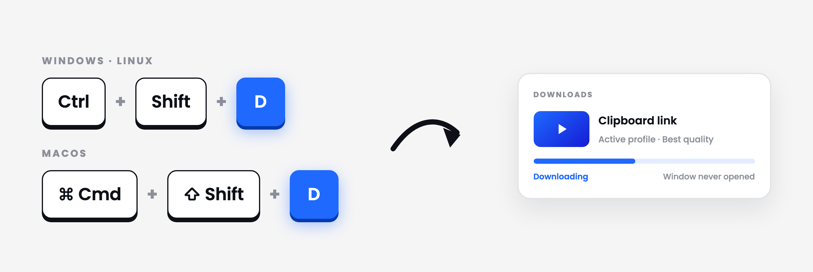

<div align="center">
  

# Arroxy — Baixador gratuito e de código aberto do YouTube (+ 2000 sites) para Windows, macOS e Linux

**4K · 1080p60 · HDR · Surround/Dolby audio · Playlists · MP3 · Shorts · Music · Channels · Subtitles · SponsorBlock · +2000 sites**

**Leia em:** [Afaan Oromoo](README.om.md) · [Bahasa Indonesia](README.id.md) · [Deutsch](README.de.md) · [English](README.md) · [Español](README.es.md) · [Français](README.fr.md) · [Kiswahili](README.sw.md) · [O'zbekcha](README.uz.md) · **Português** · [Tiếng Việt](README.vi.md) · [Türkçe](README.tr.md) · [አማርኛ](README.am.md) · [العربية](README.ar.md) · [اردو](README.ur.md) · [پښتو](README.ps.md) · [বাংলা](README.bn.md) · [हिन्दी](README.hi.md) · [မြန်မာဘာသာ](README.my.md) · [Ελληνικά](README.el.md) · [Русский](README.ru.md) · [Српски](README.sr.md) · [Українська](README.uk.md) · [中文](README.zh.md) · [日本語](README.ja.md)

[](https://github.com/antonio-orionus/Arroxy/releases/latest) [](https://github.com/antonio-orionus/Arroxy/actions/workflows/release.yml) [](https://arroxy.orionus.dev/)   

Baixe vídeos, Shorts, músicas, canais, podcasts ou faixas de áudio do **YouTube e de mais de 2000 sites compatíveis** — até 4K HDR a 60 fps, ou como MP3 / AAC / Opus. Roda localmente no Windows, no macOS e no Linux. **Sem anúncios, sem bloatware, sem vendas empurradas.**

[**↓ Instalar a versão mais recente**](#install) &nbsp;·&nbsp; [**Site**](https://arroxy.orionus.dev/) &nbsp;·&nbsp; [Primeira execução no Windows](#windows-first-launch) · [Primeira execução no macOS](#macos-first-launch) · [Primeira execução no Linux](#linux-first-launch)

[](https://discord.gg/ueGvXwQH8y)


Se o Arroxy economiza seu tempo, uma ⭐ ajuda outras pessoas a encontrá-lo.

</div>

> **What is Arroxy?** Arroxy is a free, open-source desktop GUI that downloads videos, audio, playlists, and subtitles from YouTube and 2000+ other [yt-dlp](https://github.com/yt-dlp/yt-dlp)-supported sites. It runs on Windows 10/11, macOS 11+ (Intel + Apple Silicon), and Linux (AppImage, Flatpak, tar.gz). MIT licensed. No account, no ads, no usage limits. Distributed via [Winget](https://winget.run/pkg/AntonioOrionus/Arroxy), [Scoop](https://github.com/antonio-orionus/scoop-bucket), [Homebrew Cask](https://github.com/antonio-orionus/homebrew-arroxy), Flatpak, AppImage, and direct download.
>
> _Last updated: 2026-09-03._

> 🌐 Esta é uma tradução assistida por IA. O [README em inglês](README.md) é a fonte da verdade. Encontrou algum erro? [PRs são bem-vindos](../../pulls).

---

## Conteúdo

- [Instalação e primeira execução](#install)
  - [Instalar por gerenciador de pacotes](#package-manager)
  - [Primeira execução no Windows](#windows-first-launch)
  - [Primeira execução no macOS](#macos-first-launch)
  - [Por que você pode ver um aviso](#why-warning)
  - [Primeira execução no Linux](#linux-first-launch)
  - [Verifique o seu download (SHA256)](#verify)
- [Por que o Arroxy](#why)
- [Recursos](#features)
- [Privacidade](#privacy)
- [Perguntas frequentes](#faq)
- [Planejamento](#roadmap)
- [Apoie o Arroxy](#support)
- [Feito com](#tech)

---

## <a id="install"></a>Instalação e primeira execução

| Plataforma | Download direto                                                                                                                                                                                                                                                                                                                                                                                                                                                                                                                                                                                                                                       |
| ------------------- | ------------------------------------------------------------------------------------------------------------------------------------------------------------------------------------------------------------------------------------------------------------------------------------------------------------------------------------------------------------------------------------------------------------------------------------------------------------------------------------------------------------------------------------------------------------------------------------------------------------------------------------------------------- |
| Windows             | [](https://github.com/antonio-orionus/Arroxy/releases/latest/download/Arroxy-win-x64-Setup.exe) [](https://github.com/antonio-orionus/Arroxy/releases/latest/download/Arroxy-win-x64-Portable.exe)                                                                                                                                                                                                        |
| macOS               | [](https://github.com/antonio-orionus/Arroxy/releases/latest/download/Arroxy-mac-arm64.dmg) [](https://github.com/antonio-orionus/Arroxy/releases/latest/download/Arroxy-mac-x64.dmg)                                                                                                                                                                                                                     |
| Linux               | [](https://github.com/antonio-orionus/Arroxy/releases/latest/download/Arroxy-linux-x64.AppImage) [](https://github.com/antonio-orionus/Arroxy/releases/latest/download/Arroxy-linux-x64.flatpak) [](https://github.com/antonio-orionus/Arroxy/releases/latest/download/Arroxy-linux-x64.tar.gz) |
| Verify              | [](https://github.com/antonio-orionus/Arroxy/releases/latest/download/SHA256SUMS)                                                                                                                                                                                                                                                                                                                                                                                                                                              |

[**Todos os arquivos da versão →**](https://github.com/antonio-orionus/Arroxy/releases/latest)

### <a id="package-manager"></a>Instalar por gerenciador de pacotes

Já usa um gerenciador de pacotes? Então você pode pular o caminho do download manual.

| Canal | Comando                                                                                |
| ------------------ | ------------------------------------------------------------------------------------------------- |
| Winget             | `winget install AntonioOrionus.Arroxy`                                                            |
| Scoop              | `scoop bucket add arroxy https://github.com/antonio-orionus/scoop-bucket && scoop install arroxy` |
| Homebrew           | `brew tap antonio-orionus/arroxy && brew install --cask arroxy`                                   |
| Flatpak (local file) | `flatpak install --user ./Arroxy-linux-x64.flatpak`                                            |

### <a id="windows-first-launch"></a>Primeira execução no Windows

Na primeira execução você pode ver **"O Windows protegeu o seu PC"** ou **"Editor desconhecido"**. Isso vale tanto para o `Arroxy-win-x64-Setup.exe` quanto para o `Arroxy-win-x64-Portable.exe`. O Arroxy é gratuito e de código aberto, e as builds para Windows não são assinadas com um certificado pago — é por isso que o SmartScreen as sinaliza. Isso **não** significa automaticamente que o Arroxy seja inseguro. Para continuar:

<div align="center">
  
  
</div>

1. Clique em **Mais informações**.
2. Clique em **Executar assim mesmo**.

#### Se o Windows Defender sinalizar ou remover o arquivo

As heurísticas do Defender às vezes sinalizam como suspeitos instaladores NSIS e executáveis portáteis do Electron sem assinatura. Se o Defender colocar o `Arroxy-win-x64-Setup.exe` ou o `Arroxy-win-x64-Portable.exe` em quarentena, restaure-o em **Segurança do Windows → Proteção contra vírus e ameaças → Histórico de proteção** e depois adicione o executável do Arroxy como item permitido em **Gerenciar configurações → Adicionar ou remover exclusões**. Assim como no SmartScreen, o gatilho é a falta da assinatura do publicador, não a detecção de malware.

> Baixe o Arroxy apenas pela página oficial de releases do GitHub. Se você recebeu o arquivo de outro site ou de alguém, apague-o e baixe uma cópia nova na fonte oficial. O código-fonte é público, então você pode inspecioná-lo ou compilar o Arroxy por conta própria se preferir.

### <a id="macos-first-launch"></a>Primeira execução no macOS

O Arroxy ainda não é assinado digitalmente para macOS, então o Gatekeeper pode mostrar a assustadora mensagem *"O Arroxy.app está danificado e não pode ser aberto"* depois que você o instala pelo DMG. Essa mensagem quer dizer que o macOS colocou em quarentena um app sem assinatura; não quer dizer que os arquivos do app estejam realmente danificados. Nas versões atuais do macOS, a solução confiável é pelo Terminal:

<div align="center">
  
</div>

1. Arraste o `Arroxy.app` do DMG montado para a pasta `/Applications`.
2. Abra o Terminal e rode estes dois comandos:

```bash
sudo xattr -dr com.apple.quarantine /Applications/Arroxy.app
open /Applications/Arroxy.app
```

O primeiro comando remove o atributo de quarentena da sua cópia instalada do Arroxy. O segundo abre o app. O `sudo` pode pedir a senha do seu Mac; o Terminal não mostra os caracteres enquanto você digita.

**Apple Silicon x Intel:** em um Mac com chip M (M1 / M2 / M3 / M4), baixe o DMG `arm64`. Em Macs Intel, baixe o DMG `x64`. A build errada ainda funciona via Rosetta, mas fica visivelmente mais lenta.

> As builds para macOS são geradas por CI em runners Apple Silicon e Intel. Se você encontrar problemas, [abra uma issue](../../issues) — o retorno de quem usa macOS orienta ativamente o ciclo de testes nessa plataforma.

### <a id="why-warning"></a>Por que você pode ver um aviso

O Arroxy é de código aberto e licenciado sob MIT. As builds para Windows e macOS **não são assinadas digitalmente** — os certificados Apple Developer ID e de assinatura EV do Windows custam centenas de dólares por ano cada um, e um projeto independente paga isso do próprio bolso. Sem essas assinaturas, o SmartScreen do Windows e o Gatekeeper do macOS avisam na primeira execução. Os avisos dizem que *o seu sistema não reconhece o publicador* — não que o Arroxy seja malware.

Três formas de verificar o Arroxy por conta própria, em ordem crescente de rigor:

- **Leia o código-fonte.** Cada linha está no [GitHub](https://github.com/antonio-orionus/Arroxy) e você pode [compilar a partir do código](#tech).
- **Confira o SHA256.** Compare o seu arquivo com o [`SHA256SUMS`](https://github.com/antonio-orionus/Arroxy/releases/latest/download/SHA256SUMS) publicado — veja [Verifique o seu download](#verify) abaixo.
- **Rode uma varredura de terceiros.** Envie o arquivo para o [VirusTotal](https://www.virustotal.com).

### <a id="linux-first-launch"></a>Primeira execução no Linux

AppImages rodam direto — sem instalação. Você só precisa marcar o arquivo como executável.

**Gerenciador de arquivos:** clique com o botão direito no `.AppImage` → **Propriedades** → **Permissões** → ative **Permitir execução do arquivo como programa** e depois dê dois cliques.

**Terminal:**

```bash
chmod +x Arroxy-linux-x64.AppImage
./Arroxy-linux-x64.AppImage
```

Se mesmo assim não abrir, execute sem montagem — não precisa do pacote FUSE:

```bash
./Arroxy-linux-x64.AppImage --appimage-extract-and-run
```

**Integração opcional com o desktop:** instale o [AppImageLauncher](https://github.com/TheAssassin/AppImageLauncher) uma vez e qualquer AppImage em que você der dois cliques é registrado automaticamente no menu de aplicativos — sem precisar criar um arquivo `.desktop` na mão.

**Tarball simples (sem FUSE, sem instalação):**

A versão `.tar.gz` é o mesmo app sem o invólucro AppImage — extraia em qualquer lugar e execute. Sem instalador e sem pacote FUSE.

```bash
tar xzf Arroxy-linux-x64.tar.gz
./Arroxy-linux-x64/arroxy
```

**Flatpak (alternativa em sandbox):** baixe o `Arroxy-linux-x64.flatpak` na mesma página de release.

O Ubuntu vem com Snap em vez de Flatpak, então instale o Flatpak e adicione o Flathub primeiro — o pacote baixa o runtime de lá:

```bash
# Ubuntu / Debian
sudo apt install -y flatpak

# Fedora
sudo dnf install -y flatpak

# Arch
sudo pacman -S flatpak
```

```bash
flatpak remote-add --user --if-not-exists flathub https://dl.flathub.org/repo/flathub.flatpakrepo
flatpak install --user ./Arroxy-linux-x64.flatpak
flatpak run io.github.antonio_orionus.Arroxy
```

**Os downloads de Linux na página de versões são apenas x86_64.** Em máquinas ARM64 (Raspberry Pi, Asahi Linux) o Flatpak instala, mas falha ao iniciar com `bwrap: execvp ldconfig: Exec format error`.

<details>
<summary><strong><a id="verify"></a>Verifique o seu download (SHA256)</strong></summary>

Toda release publica um arquivo `SHA256SUMS` junto com os binários. Para conferir se o seu download não foi corrompido ou adulterado no caminho, calcule o hash do arquivo localmente e compare com a linha correspondente no `SHA256SUMS`. Abra a página da última release → **Assets** → baixe o `SHA256SUMS`.

**Windows (PowerShell ou Prompt de Comando):**

```powershell
certutil -hashfile Arroxy-win-x64-Setup.exe SHA256
```

**macOS (Terminal):**

```bash
shasum -a 256 Arroxy-mac-arm64.dmg
```

**Linux (Terminal):**

```bash
sha256sum Arroxy-linux-x64.AppImage
```

Quer uma varredura antimalware de terceiros? Envie o arquivo para o [VirusTotal](https://www.virustotal.com). Alguns poucos alertas de heurística genérica vindos de motores menores são normais em apps Electron sem assinatura; detecções generalizadas nos principais motores seriam motivo real de preocupação.

</details>

<details>
<summary><strong>Windows: instalador ou portátil</strong></summary>

|               | Instalador NSIS | `.exe` portátil |
| ------------- | :----------------------: | :---------------------: |
| Precisa instalar | Sim  | Não — rode de qualquer lugar  |
| Atualizações automáticas | ✅ dentro do app  | ❌ download manual  |
| Velocidade de inicialização | ✅ mais rápida  | ⚠️ início a frio mais lento  |
| Adiciona ao menu Iniciar |            ✅            |           ❌            |
| Desinstalação fácil |            ✅            | ❌ apague o arquivo  |

**Recomendação:** use o instalador NSIS para ter atualizações automáticas e inicialização mais rápida. Use o `.exe` portátil se quiser uma opção sem instalação e sem registro.

</details>

---

## <a id="why"></a>Por que o Arroxy

Uma comparação lado a lado com as alternativas mais comuns:

|            | Arroxy | 4K Video Downloader | JDownloader | Y2Mate / online converters | Browser extensions |
| ---------- | :----: | :-----------------: | :---------: | :------------------------: | :----------------: |
| Gratuito, sem plano premium |   ✅   |         ⚠️          |     ✅      |             ⚠️             |         ⚠️         |
| Código aberto |   ✅   |         ❌          |     ❌      |             ❌             |         ⚠️         |
| Processamento apenas local |   ✅   |         ✅          |     ✅      |             ❌             |         ✅         |
| Sem login nem exportação de cookies |   ✅   |         ⚠️          |     ⚠️      |             ⚠️             |         ✅         |
| Sem limites de uso |   ✅   |         ⚠️          |     ✅      |             🚫             |         ⚠️         |
| App de desktop multiplataforma |   ✅   |         ✅          |     ✅      |            N/A             |         ❌         |
| Legendas + SponsorBlock |   ✅   |         ⚠️          |     ❌      |             ❌             |         ❌         |

O Arroxy foi feito para uma coisa só: você cola uma URL e recebe um arquivo local limpo. Sem contas, sem vendas empurradas, sem coleta de dados.

---

## <a id="features"></a>Recursos

### Qualidade e formatos

- Até **4K UHD (2160p)**, 1440p, 1080p, 720p, 480p, 360p
- **Alta taxa de quadros** preservada como está — 60 fps, 120 fps, HDR
- **Áudio** — exporte apenas o áudio como MP3, M4A/AAC, Opus ou WAV. Nos downloads interativos, escolha as faixas surround/Dolby nativas da fonte (AC-3, E-AC-3, 5.1, DRC) quando existirem, ou defina um padrão global de **Preferir surround / Dolby**
- Predefinições rápidas: *Melhor qualidade* · *Equilibrado* · *Arquivo pequeno*

### Privacidade e controle

- Processamento 100% local — os downloads vão direto do YouTube para o seu disco
- **Código aberto** — cada linha pode ser auditada, sob licença MIT
- Arquivos salvos direto na pasta que você escolher

### Fluxo de trabalho

- **Atalho global de download** — copie um link em qualquer app e pressione `Ctrl+Shift+D` (`Cmd+Shift+D` no macOS); o Arroxy o coloca na fila com o seu perfil ativo sem abrir a janela, e uma notificação confirma. Ativo por padrão e reconfigurável
- **Modos de início flexíveis** — escolha um download individual guiado, o seletor de playlist/canal, a colagem de URLs em massa ou o Quick Download com os seus padrões salvos
- **Fila central de downloads** — todo trabalho individual, de playlist, em massa ou rápido chega a um só lugar, com progresso, pausa, retomada, cancelamento, nova tentativa e controle de prioridade
- **Monitoramento da área de transferência** — copie um link do YouTube e o Arroxy preenche a URL automaticamente quando você volta para o app (ative nas configurações avançadas)
- **Limpeza automática de URLs** — remove parâmetros de rastreamento (`si`, `pp`, `utm_*`, `fbclid`, `gclid`) e desempacota links `youtube.com/redirect`
- **Modo bandeja** — fechar a janela mantém os downloads rodando em segundo plano
- **24 idiomas** — detecta automaticamente o idioma do sistema e pode ser trocado a qualquer momento
- **Sincronização de playlists** — reanalise uma playlist comparando com uma pasta local para pular vídeos já baixados; gera um arquivo de playlist `.m3u` que é atualizado a cada vídeo baixado
- **Controles de velocidade e ritmo** — limite a banda de download, defina quantas partes de um vídeo são baixadas ao mesmo tempo e adicione atrasos entre requisições com predefinições (*Desligado · Equilibrado · Cuidadoso · Personalizado*)
- **Modelos de nome de arquivo** — nomeie os downloads do seu jeito com `{title}`, `{uploader}`, `{id}`, `{date}`, `{resolution}` e `{playlist_index}`, de forma global ou por perfil de download
- **Downloads simultâneos e nova tentativa automática** — escolha quantos downloads da fila rodam ao mesmo tempo e deixe o Arroxy tentar de novo um download que esbarrou em um problema de rede ou de servidor, esperando mais tempo a cada tentativa
- **Perfis por item da playlist** — atribua a cada vídeo de uma playlist o seu próprio perfil de download, em vez de uma única configuração para a lista inteira, para arquivar alguns em qualidade máxima e pegar o restante como MP3 em uma só passada

### Legendas e pós-processamento

- **Legendas** em SRT, VTT ou ASS — manuais ou geradas automaticamente, em qualquer idioma disponível
- Salve ao lado do vídeo, incorpore no `.mkv` ou organize em uma subpasta `Subtitles/`
- **SponsorBlock** — pule ou marque como capítulos os trechos de patrocínio, introduções, encerramentos e autopromoções
- **Metadados incorporados** — título, data de publicação, canal, descrição, miniatura e marcadores de capítulo gravados no arquivo

### YouTube + 2000 sites

- **YouTube completo** — vídeos, Shorts, canais, playlists, YouTube Music e podcasts tratados como fontes de primeira classe
- **Mais de 2000 outros sites** via yt-dlp — Vimeo, Twitch, Twitter/X, TikTok, SoundCloud, Bandcamp, Bilibili, BBC iPlayer, archive.org e muitos outros
- **Apenas áudio e legendas** funcionam em todos os sites compatíveis, não só no YouTube
- Se um site mudar, o yt-dlp lança correções toda semana e o Arroxy atualiza o binário automaticamente na inicialização

<table align="center" width="100%">
  <tr>
    <td colspan="2" valign="top" align="center"><picture><source media="(prefers-color-scheme: dark)" srcset="build/Global-hotkey-dark.png" /></picture><br/> <sub><b>Atalho global de download</b><br/>Copie um link em qualquer lugar, pressione uma vez — ele entra na fila e começa a baixar</sub></td>
  </tr>
  <tr>
    <td colspan="2" valign="top" align="center"><br/> <sub><b>Perfis por item da playlist</b><br/>Dê a cada vídeo o seu próprio perfil — arquive alguns em 4K e pegue o restante como MP3</sub></td>
  </tr>
  <tr>
    <td width="50%" valign="top" align="center"><br/><sub><b>Tela inicial do Quick Download</b><br/>Cole uma URL e baixe na hora com o seu perfil ativo</sub></td>
    <td width="50%" valign="top" align="center"><br/><sub><b>Perfis de download reutilizáveis</b><br/>Salve predefinições de formato, qualidade e saída — reutilize a cada download</sub></td>
  </tr>
  <tr>
    <td width="50%" valign="top" align="center"><br/><sub><b>Faixas de áudio em vários idiomas</b><br/>Escolha exatamente o idioma do áudio que o vídeo oferece</sub></td>
    <td width="50%" valign="top" align="center"><br/><sub><b>Áudio surround / Dolby</b><br/>Faixas 5.1 e Dolby detectadas e preservadas</sub></td>
  </tr>
  <tr>
    <td width="50%" valign="top" align="center"><br/><sub><b>Modo de URLs em massa</b><br/>Cole uma lista, remova duplicatas automaticamente e enfileire tudo de uma vez</sub></td>
    <td width="50%" valign="top" align="center"><br/><sub><b>Fila de downloads paralelos</b><br/>Vários downloads ao mesmo tempo com progresso ao vivo</sub></td>
  </tr>
</table>

---

## <a id="privacy"></a>Privacidade

Os downloads são feitos direto pelo [yt-dlp](https://github.com/yt-dlp/yt-dlp), do YouTube para a pasta que você escolher — nada passa por um servidor de terceiros. Histórico de vídeos, histórico de downloads, URLs e o conteúdo dos arquivos ficam no seu dispositivo.

O Arroxy envia telemetria anônima e agregada pelo [OpenPanel](https://openpanel.dev) — apenas o suficiente para um projeto independente entender falhas, quedas, feedback, sistema operacional e versões do app. Sem URLs, títulos de vídeo, caminhos de arquivo, dados de conta, fingerprinting ou dados pessoais. O identificador por instalação é aleatório e não está ligado à sua identidade. Você pode desativar nas configurações.

---

## <a id="faq"></a>Perguntas frequentes

**É realmente gratuito?**
Sim — licença MIT, sem plano premium, sem recursos bloqueados.

**Que qualidades de vídeo eu posso baixar?**
Tudo o que o YouTube oferecer: 4K UHD (2160p), 1440p, 1080p, 720p, 480p, 360p, além de apenas áudio. Streams em 60 fps, 120 fps e HDR são preservados como estão.

**Dá para extrair só o áudio em MP3?**
Sim. Escolha *apenas áudio* no menu de formatos e selecione MP3, M4A/AAC, Opus ou WAV.

**Preciso de uma conta do YouTube ou de cookies?**
Por padrão, não — o Arroxy funciona sem conta do YouTube, sem login e sem exportar cookies. O suporte opcional a cookies está nas configurações avançadas (origem dos cookies: arquivo ou navegador) para conteúdos que exigem autenticação, como vídeos com restrição de idade ou exclusivos para membros. Ele vem desligado. Se você ativá-lo, a wiki do yt-dlp alerta que [a automação baseada em cookies pode marcar uma conta Google](https://github.com/yt-dlp/yt-dlp/wiki/Extractors#exporting-youtube-cookies); nesse caso, uma conta descartável é a opção mais segura.

**Vai continuar funcionando quando o YouTube mudar alguma coisa?**
O yt-dlp é atualizado automaticamente na inicialização, e o Arroxy lança correções rapidamente quando o YouTube muda algo. Se ainda assim você esbarrar em um problema, o suporte opcional a cookies está disponível nas configurações avançadas como alternativa.

**Em quais idiomas o Arroxy está disponível?**
24 idiomas, prontos para uso: Afaan Oromoo · Bahasa Indonesia · Deutsch · English · Español · Français · Kiswahili · O'zbekcha · Português · Tiếng Việt · Türkçe · አማርኛ · العربية · اردو · پښتو · বাংলা · हिन्दी · မြန်မာဘာသာ · Ελληνικά · Русский · Српски · Українська · 中文 · 日本語. O Arroxy detecta automaticamente o idioma do seu sistema operacional na primeira execução, e você pode trocar quando quiser pelo seletor de idiomas na barra de ferramentas. Os JSON de idioma usados em runtime ficam em src/shared/i18n/locales/, e os catálogos PO para tradutores ficam em i18n/locales/ — abra um PR no GitHub para contribuir.

**Preciso instalar mais alguma coisa?**
Não. O yt-dlp é baixado automaticamente na primeira execução e fica em cache na sua máquina; o ffmpeg e o ffprobe já vêm com o app. Depois disso, nenhuma configuração extra é necessária.

**Dá para baixar playlists ou canais inteiros?**
Sim — os dois. Cole a URL de uma playlist ou de um canal (por exemplo `youtube.com/@handle`, `/channel/UC…`, `/c/Nome`, `/user/Antigo`); escolha quantos itens analisar e depois enfileire a lista inteira ou selecione vídeos específicos. Filtros por intervalo de datas estão a caminho.

**O macOS diz que "o app está danificado" — o que eu faço?**
É o Gatekeeper do macOS bloqueando um app sem assinatura, não um dano real. Veja [Primeira execução no macOS](#macos-first-launch) para os comandos de Terminal que removem a quarentena e abrem o Arroxy.

**Baixar vídeos do YouTube é legal?**
Para uso pessoal e privado, costuma ser aceito na maioria das jurisdições. Você é responsável por cumprir os [Termos de Serviço](https://www.youtube.com/t/terms) do YouTube e as leis de direito autoral do seu país.

---

## <a id="roadmap"></a>Planejamento

Ainda planejado — mais ou menos em ordem de prioridade:

| Recurso    | Descrição    |
| ---------------- | ---------------- |
| **Filtros de playlist e canal** | Filtros por intervalo de datas ao enumerar uma playlist ou um canal |
| **Preferências de faixa de áudio do YouTube** | Defina uma preferência global de idioma falado, com substituições por perfil quando o YouTube oferecer várias faixas de áudio |
| **Login pelo navegador dentro do app** | Abrir janelas de navegador dentro do Arroxy para você fazer login e usar os cookies do site sem exportá-los manualmente |
| **Download de vídeo em um clique** | Iniciar o download de um vídeo com um clique a partir de uma URL detectada ou colada, usando o seu perfil ativo |
| **Recuperação de tentativas mais robusta** | Um novo caminho de nova tentativa para downloads interrompidos por conexões instáveis ou problemáticas |
| **Gaveta completa de gerenciamento de downloads** | Transformar a gaveta da fila em um gerenciador mais completo, incluindo a troca da pasta de destino dos itens enfileirados |
| **Downloads agendados** | Iniciar uma fila em um horário definido (execuções durante a madrugada) |
| **Corte de trechos** | Baixar apenas um trecho, por horário de início e fim |

Tem um recurso em mente? [Abra um pedido](../../issues) — a participação da comunidade define as prioridades.

---

## <a id="support"></a>Apoie o Arroxy

O Arroxy é gratuito e licenciado sob MIT — sem anúncios, sem plano pago. Se ele economiza o seu tempo, você pode apoiar o desenvolvimento com Bitcoin ou Tron: os endereços estão no [DONATE.md](DONATE.md), que é a única fonte oficial deles. O Arroxy nunca vai te enviar um endereço por e-mail ou mensagem direta. Dar uma estrela ao repositório, relatar bugs e melhorar as traduções ajuda tanto quanto.

<a href="DONATE.md"></a> <a href="DONATE.md"></a>

---

## <a id="tech"></a>Feito com

<details>
<summary><strong>Stack</strong></summary>

- **Electron** — shell de desktop multiplataforma
- **React 19** + **TypeScript** — interface
- **Tailwind CSS v4** — estilos
- **Zustand** — gerenciamento de estado
- **yt-dlp** + **ffmpeg** — motor de download e mux (o yt-dlp é baixado em runtime; ffmpeg/ffprobe vêm embutidos na compilação)
- **Vite** + **electron-vite** — ferramentas de build
- **Vitest** + **Playwright** — testes unitários e de ponta a ponta

</details>

<details>
<summary><strong>Compilar a partir do código-fonte</strong></summary>

### Pré-requisitos — todas as plataformas

| Ferramenta | Versão   | Instalação |
| ---------- | -------- | ---------- |
| Git        | qualquer | [git-scm.com](https://git-scm.com) |
| Node.js    | 24.16.0  | `mise install` ou `.node-version` |
| Bun        | 1.2.23   | `mise install` ou `packageManager` do `package.json` |

Recomendado: instale o `mise` e rode `mise install` no checkout. Sem o mise, ative manualmente o Node.js a partir do `.node-version` e o Bun a partir do `package.json` antes de rodar `bun run bootstrap`.

### Windows

```powershell
powershell -c "irm bun.sh/install.ps1 | iex"
```

O Visual Studio Build Tools e o Python podem ser necessários para recompilar módulos nativos.

### macOS

```bash
brew install mise
xcode-select --install
```

Depois de clonar, rode `mise trust && mise install` no checkout. Se o seu shell já usa `fnm`, `nvm` ou um Bun do Homebrew, ative o mise no `~/.zshrc` para que o Arroxy use o Node.js 24.16.0 e o Bun 1.2.23:

```bash
printf '
# mise
if command -v mise >/dev/null 2>&1; then
  eval "$(mise activate zsh)"
fi
' >> ~/.zshrc
exec zsh
```

### Linux (Ubuntu / Debian)

```bash
curl -fsSL https://bun.sh/install | bash

# Dependências de build + runtime do Electron
sudo apt install -y build-essential python3 tar libgtk-3-0 libnss3 libasound2t64

# Somente para testes E2E (o Electron precisa de um display)
sudo apt install -y xvfb
```

### Clonar e executar

```bash
git clone https://github.com/antonio-orionus/Arroxy
cd Arroxy
mise trust
mise install           # recomendado; pule se você já ativou manualmente as versões fixadas
bun run bootstrap
bun run doctor
bun run dev            # app Electron rodando contra o renderer do Vite
```

### Gerar um pacote distribuível

```bash
bun run build        # typecheck + compilação
bun run dist         # empacota para o sistema atual
bun run dist:win     # empacota os alvos Windows quando executado em um host compatível
```

> O `bun run bootstrap` instala as dependências, recompila as dependências nativas do Electron, verifica o Electron, prepara o ffmpeg/ffprobe embutidos para desenvolvimento e instala o Chromium do Playwright. O yt-dlp é gerenciado em runtime na sua pasta de dados do app; o ffmpeg e o ffprobe acompanham todas as versões do Arroxy.

</details>

---

## <a id="troubleshooting"></a>Troubleshooting

### App won't open / no window appears

The Arroxy process starts but no window shows up. Most often this is a GPU driver hang during startup. Try, in order:

**1. Check the log.** It records startup, GPU info, and any crash. Path:

| Platform | Path                             |
| -------- | -------------------------------- |
| Windows  | `%APPDATA%\Arroxy\logs\main.log` |
| macOS    | `~/Library/Logs/Arroxy/main.log` |
| Linux    | `~/.config/Arroxy/logs/main.log` |

**2. Launch with hardware acceleration disabled.** Open a terminal / Command Prompt and run the executable with a flag:

```bash
# Windows (Portable) — PowerShell, run from the folder containing the exe
.\Arroxy-win-x64-Portable.exe --disable-gpu

# Windows (Portable) — Command Prompt (cmd.exe), from the same folder
Arroxy-win-x64-Portable.exe --disable-gpu

# Windows (Installed) — works in both PowerShell and cmd.exe
"%LOCALAPPDATA%\Programs\Arroxy\Arroxy.exe" --disable-gpu

# macOS
/Applications/Arroxy.app/Contents/MacOS/Arroxy --disable-gpu

# Linux (AppImage)
./Arroxy-linux-x64.AppImage --disable-gpu
```

If that works, the GPU/driver is the cause. Make the change permanent (next step).

**3. Persist the flag via `argv.json`.** Create the file at:

| Platform | Path                                             |
| -------- | ------------------------------------------------ |
| Windows  | `%APPDATA%\Arroxy\argv.json`                     |
| macOS    | `~/Library/Application Support/Arroxy/argv.json` |
| Linux    | `~/.config/Arroxy/argv.json`                     |

With contents:

```json
{ "disable-hardware-acceleration": true }
```

Arroxy reads this before opening any window, so it works even when the window never appeared.

**4. Other flags worth trying** (combine if needed): `--disable-software-rasterizer`, `--disable-gpu-sandbox`, `--in-process-gpu`.

**5. Stale window position.** If the window may be opening off-screen (multi-monitor change since last run), delete `<userData>\window-state.json` and relaunch.

**6. Still stuck?** Open an issue with: OS version, the contents of `main.log`, and any output from running with `--enable-logging --v=1`.

---

## Termos de uso

O Arroxy é uma ferramenta para uso pessoal e privado apenas. Você é o único responsável por garantir que os seus downloads cumpram os [Termos de Serviço](https://www.youtube.com/t/terms) do YouTube e as leis de direito autoral da sua jurisdição. Não use o Arroxy para baixar, reproduzir ou distribuir conteúdo que você não tem o direito de usar. Os desenvolvedores não se responsabilizam por qualquer uso indevido.

## Star History

<a href="https://www.star-history.com/?repos=antonio-orionus%2FArroxy&type=timeline&legend=top-left">
 <picture>
   <source media="(prefers-color-scheme: dark)" srcset="https://api.star-history.com/chart?repos=antonio-orionus/Arroxy&type=timeline&theme=dark&legend=top-left" />
   <source media="(prefers-color-scheme: light)" srcset="https://api.star-history.com/chart?repos=antonio-orionus/Arroxy&type=timeline&legend=top-left" />
   
 </picture>
</a>

<div align="center">
  <sub>Licença MIT · Feito com cuidado por <a href="https://x.com/OrionusAI">@OrionusAI</a></sub>
</div>
